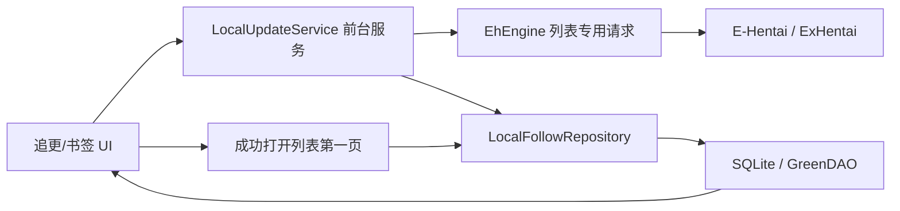

# EhViewer_CN_SXJ_manbo 项目交接文档

> 本文根据当前工作区的 `README.md` 和实际代码整理，重点说明本分支新增的本地追更、书签更新、更新分割线、更新任务、自动拼接中文、JM 号查询及 IGNEOUS 手动刷新。文档基线日期为 2026-07-27；当前工作区存在未提交修改，因此接手后应先执行 `git status`，不要只按最后一次提交判断功能状态。

## 1. 当前项目状态

这是基于 EhViewer 的 Android 客户端，保留原有浏览、搜索、收藏、下载、服务器 Watched 等能力，并在本地增加一套不依赖服务器订阅的追更和更新计数系统。

当前实际构建参数以 `app/build.gradle` 为准：

| 项目 | 当前值 |
| --- | --- |
| Gradle | 9.4.1 |
| Android Gradle Plugin | 9.2.1 |
| Kotlin Android Plugin | 2.2.10 |
| Java / Kotlin JVM Target | 21 |
| compileSdk | 35 |
| targetSdk | 30 |
| minSdk | 23 |
| NDK | 30.0.15729638 |
| namespace | `com.hippo.ehviewer` |
| Release applicationId | `com.xjs.ehviewer` |
| Debug applicationId | `com.xjs.ehviewer.debug` |
| versionName | `2.0.2.4` |
| Release versionCode | 112 |
| Debug versionCode | 120 |
| GreenDAO Schema Version | 11 |

README 的 Build 段已同步为 `2.0.2.4 / 120`。发布、提测、反馈问题时仍应以 `app/build.gradle` 和 `output-metadata.json` 为最终依据。

项目模块：

- `app`：Android 主应用，绝大多数业务代码都在这里。
- `daogenerator`：GreenDAO 实体代码生成模块。
- `app/src/main/cpp`：图片、压缩包等原生能力及第三方 native 源码。

当前新增功能主要仍采用原项目的 Java/Kotlin + Scene/Fragment UI、OkHttp 3、SQLite/GreenDAO 架构，没有引入 ViewModel、Room 或 WorkManager。

## 2. 代码入口速查

| 功能 | 主要入口 |
| --- | --- |
| 应用初始化 | `app/src/main/java/com/hippo/ehviewer/EhApplication.java` |
| 数据库初始化和迁移 | `app/src/main/java/com/hippo/ehviewer/EhDB.java` |
| 新增表定义 | `app/src/main/java/com/hippo/ehviewer/subscription/SubscriptionSchema.java` |
| 本地追更仓库 | `app/src/main/java/com/hippo/ehviewer/subscription/LocalFollowRepository.java` |
| 更新前台服务 | `app/src/main/java/com/hippo/ehviewer/subscription/LocalUpdateService.java` |
| 更新任务持久化 | `app/src/main/java/com/hippo/ehviewer/subscription/LocalRefreshJobStore.java` |
| 自动基线队列 | `app/src/main/java/com/hippo/ehviewer/subscription/LocalBaselineQueue.java` |
| 全局扫描游标 | `app/src/main/java/com/hippo/ehviewer/subscription/LocalGlobalCursorStore.java` |
| 追更/书签右侧抽屉 | `SubscriptionDraw.java`、`BookmarksDraw.java` |
| 追更管理页 | `LocalFollowScene.java` |
| 统一任务对话框 | `LocalUpdateStartDialog.java`、`LocalUpdateTaskDialog.java`、`LocalUpdateToolbarController.java` |
| 列表打开、分割线、清零 | `GalleryListScene.java` |
| 标签长按菜单 | `GalleryListSceneDialog.kt` |
| 查询 URL 和中文过滤 | `ListUrlBuilder.java` |
| 书签更新规则 | `BookmarkUpdatePolicy.java`、`BookmarkGlobalMatcher.java` |
| 列表专用网络请求 | `EhEngine.getGalleryListForUpdate()` |
| 追更 JSON | `LocalFollowJson.java`、`AdvancedFragment.java` |
| JM 查询 UI | `JmQueryScene.java` |
| JM 网络和协议 | `JmClient.java`、`JmApiCodec.java`、`JmIdParser.java` |
| IGNEOUS 手动刷新 | `IdentityCookiePreference.java`、`IgneousUtils.java` |

## 3. 总体实现结构

新增更新系统分为四层：

1. UI 层发起任务或打开列表。
2. `LocalUpdateService` 串行执行网络检查。
3. `LocalFollowRepository` 和 `SubscriptionRepository` 在事务中提交游标、未读 GID 和计数。
4. `SubscriptionDraw`、`BookmarksDraw`、`GalleryListScene` 重新读取持久化状态并渲染角标或分割线。

核心数据流如下：



必须理解的设计点：

- 更新计数基于 `postedTimestamp + GID`，不是只比较时间，也不是比较列表位置。
- 检查更新的边界和“上次更新到这”的打开边界是两套独立 checkpoint。
- 未读内容按 GID 去重，重复检查不会重复累计。
- 一次任务不是全局事务；已经检查完成的项目会立即提交，后续暂停或失败不会回滚前面的结果。
- 服务全局只允许一个追更、书签或基线任务运行。

## 4. 本地追更

### 4.1 添加和删除

漫画列表和详情页的标签长按最终都会进入 `GalleryListSceneDialog.showTagLongPressDialog()`。菜单中的“追更/取消追更”调用：

- 添加：`LocalFollowRepository.add(tag)`
- 删除：`LocalFollowRepository.remove(tag)`
- 添加成功后：`LocalUpdateService.startPendingBaselines(context)`

本地追更只接受标准 `namespace:value` 标签。允许的 namespace 在 `LocalFollowJson.NAMESPACES` 中，包括：

`artist`、`group`、`parody`、`character`、`female`、`male`、`misc`、`language`、`cosplayer`、`mixed`、`other`、`reclass`。

标签会经过：

- 去除首尾空格；
- 连续空白压缩为一个空格；
- 转成小写；
- 以规范化后的标签名作为主键。

添加时在一个数据库事务中完成：

1. 写入 `LOCAL_FOLLOW_TAG`。
2. 立即写一条 `0` 状态到 `LOCAL_UPDATE_STATE`。
3. 写入 `LOCAL_BASELINE_QUEUE`，等待自动细化基线。
4. 刷新内存中的 `SubscriptionSnapshot`。

因此 UI 不必等待第一次手动检查就能显示 `0`。

删除时会同时清除该标签的：

- 追更主记录；
- 更新状态；
- 未读 GID；
- 更新和打开 checkpoint；
- 待执行的自动基线。

服务器 Watched 与本地追更是两套数据：

- 本地追更来自 `LOCAL_FOLLOW_TAG`，不需要登录。
- 左侧导航的“订阅”仍打开服务器 `/watched` 列表。
- 标签长按中的服务器“订阅/排除”按钮仍通过 E-Hentai 接口工作，并且仅在登录后显示。

右侧原订阅抽屉现在由 `SubscriptionDraw.loadLocalData()` 从本地追更表构造 `UserTagList` 外观数据，不再以服务器 `UserTagList` 作为数据源。`SubscriptionDraw` 中仍留有一部分旧服务器标签请求方法，但当前抽屉入口不会调用它们。

### 4.2 自动基线

“基线”表示从哪个发布时间开始算新增。新条目先建立临时时间基线，再由后台请求细化：

1. `BaselineBoundaryPolicy.provisional()` 取“添加时间的下一整秒”作为临时水位。
2. `LocalBaselineQueue` 持久化待处理项目。
3. `LocalUpdateService` 读取第一页，寻找不晚于添加时刻的最新完整时间组。
4. 同一秒的所有 GID 必须一起进入边界，防止漏计同秒结果。
5. 如果目标时间组正好顶到页面末尾，无法证明该秒已经完整，保留更安全的临时时间基线。

基线方法：

| 场景 | 方法 | 实际行为 |
| --- | --- | --- |
| 单个新追更 | `FOLLOW_TAG` | 请求该标签第一页 |
| JSON/数据库批量导入追更 | `FOLLOW_GLOBAL` | 同批项目共享一页全局中文结果 |
| 新书签 | `BOOKMARK` | 请求该书签自己的第一页 |

网络失败会最多尝试 3 次。无法细化时队列状态变为 `FALLBACK`，保留添加时刻基线，不把任务无限卡住。

### 4.3 追更列表显示

右侧追更列表由 `SubscriptionDraw` 渲染：

- 状态未初始化时只显示标签名。
- 基线建立后显示 `0`。
- 有新增时显示 `1–20` 或 `20+`。
- 正数和 `20+` 使用绿色 `●`，零使用普通 `·`。
- 排序先按更新数降序，再按 `checkedAt` 降序，最后按标签名排序。

追更设置按钮进入 `LocalFollowScene`，该页面只提供搜索和删除，不提供直接输入标签添加。正常添加入口仍是列表或详情页的标签长按。

## 5. 更新计数算法

### 5.1 边界模型

`FeedBoundary` 包含：

- `time`：Unix 秒；
- `gids`：该秒已经存在的全部 Gallery ID。

判断规则：

- `postedTimestamp > time`：新内容。
- `postedTimestamp == time` 且 GID 不在边界集合：新内容。
- `postedTimestamp < time`：旧内容。
- `postedTimestamp == time` 且 GID 已在边界集合：旧内容。

只保存时间会漏掉服务器稍后索引、但发布时间处于同一秒的画廊，因此同秒 GID 集合不能删。

### 5.2 数据完整性

更新任务不直接使用普通浏览请求，而调用 `EhEngine.getGalleryListForUpdate()`：

- 不应用用户本地的标题、上传者、标签过滤器；
- 从列表 HTML 读取结果；
- 若 `simpleTags`、发布时间、分类、上传者、页数或评分不完整，再调用 `gdata` 补齐；
- `gdata` 每批最多 25 个；
- 返回的 `GalleryInfo` 才用于本地匹配和计数。

普通浏览设置的请求间隔不会影响这里；更新间隔也只在发出“搜索列表请求”前等待，不额外限制同一列表请求触发的 `gdata` 补全。

### 5.3 未读去重和 `20+`

每个来源的新 GID 写入 `LOCAL_UNREAD_GALLERY`，主键为：

`SOURCE_TYPE + SOURCE_KEY + GID`

所以同一个画廊在多轮检查中只计一次。每个来源最多保留最近 21 条未读 GID：

- 0–20 条可精确显示。
- 达到 21 条或扫描无法覆盖旧边界时显示 `20+`，状态为 `LOWER_BOUND`。
- `TagUpdateState` 对外显示时把数值封顶为 20，是否为下界由 `COUNT_STATE` 区分。

### 5.4 全局中文扫描

追更的 `GLOBAL` 方法：

1. 构造无关键词普通搜索并强制中文条件。
2. 从最新结果开始，最多读取 30 页。
3. 每个 Gallery 的 `simpleTags` 在本地与所有追更标签匹配。
4. 扫描越过上次 `LOCAL_GLOBAL_CURSOR` 后停止。
5. 必须继续读到比游标时间更旧的内容，同秒内不能提前停止。
6. 扫描完整时，为所有标签提交本轮匹配结果并统一前移到本轮顶部边界。
7. 30 页仍未越过游标时，降级为每个标签单独检查第一页。

第一次在某个“账号 + 站点”来源上运行全局扫描只建立零基线，不把已有结果算作新增。由旧版本升级且没有独立全局游标时，会用所有单项 checkpoint 中最旧的边界启动一次迁移。

### 5.5 逐标签第一页

追更的 `TAGS` 方法逐个构造标签搜索：

1. 请求该标签第一页。
2. 与该标签自己的 `LOCAL_FOLLOW_SYNC` checkpoint 比较。
3. 边界在第一页内时精确累计新 GID。
4. 第一页未覆盖旧边界时标记为 `20+`，不假装得到精确数量。

可重试的网络异常会进行两轮延时重试。某个项目最终失败会保留失败列表，任务整体显示失败；已成功项目不会回滚。

## 6. 书签更新

书签就是原项目的 `QuickSearch`。新增书签时，`EhDB.insertQuickSearch()` 在同一事务中调用 `LocalFollowRepository.initializeBookmark()`，立即写 `0` 和自动基线队列。

### 6.1 查询签名

书签状态不能只用名称识别。`BookmarkUpdatePolicy.querySignature()` 对以下字段生成 SHA-256 签名：

- mode；
- category；
- keyword；
- advanceSearch；
- minRating；
- pageFrom；
- pageTo；
- 固定中文策略标记。

重命名不改变签名，因此保留状态；查询条件改变后，`prepareBookmarkSignature()` 会清掉旧状态、未读 GID 和 checkpoint，重新建立零基线。

### 6.2 支持范围

可更新的 mode：

- 普通搜索 `MODE_NORMAL`
- 标签 `MODE_TAG`
- 上传者 `MODE_UPLOADER`
- 过滤搜索 `MODE_FILTER`

明确指定非中文正向语言条件时返回 `language conflict`；热门、图片搜索、榜单等特殊 mode 返回 `unsupported mode`。这类书签不发更新请求，书签抽屉显示原因而不是误导性的 `0`。

### 6.3 书签全局匹配

`BookmarkGlobalMatcher` 只在能够用 `GalleryInfo` 精确重现条件时参加共享全局扫描。

可以本地精确匹配的条件包括：

- 标签模式下的单个标准标签，保存时没有 `$` 也按精确标签处理；
- 上传者模式；
- 普通/过滤搜索中的标准正向或负向标签，无论有没有 `$`；
- 多个标准标签组成的普通 AND 查询；
- 带引号的标准标签值，例如 `female:"big breasts"` 或 `female:"big breasts"$`；
- 正向 uploader；
- 分类、最低评分、最少/最多页数。

以下情况自动降级为逐书签请求：

- 不带命名空间的普通全文关键词，包括带 `$` 的裸词，例如 `bbw`、`bbw$`；
- 标准标签与普通全文关键词混合的查询；
- `OR`、`~` 等复杂操作符；
- 通配符、模糊表达式；
- 负向 uploader；
- 不支持的命名空间；
- 无法从 `GalleryInfo` 精确判断的字段。

标准命名空间来自 `LocalFollowJson`，当前包括：

`artist`、`group`、`parody`、`character`、`female`、`male`、`misc`、`language`、`cosplayer`、`mixed`、`other`、`reclass`。

`$` 只表示用户显式指定精确匹配，不再是识别标准命名空间标签的必要条件。代码不会修改书签原关键词、补写 `$` 或改变查询签名。

共享扫描流程与追更类似，也最多 30 页，并使用书签自己的 `LOCAL_GLOBAL_CURSOR`。精确书签共享扫描结果；复杂书签和未覆盖游标的书签随后进入逐书签队列。

v120 增加了旧边界衔接保护：如果一个原先会降级、现在可以全局匹配的书签，其单项 checkpoint 早于共享全局游标，则不能直接使用只扫描到共享游标的结果。`LocalUpdateService.selectGloballyCovered()` 会先把该书签放入一次性的逐书签第一页队列；第一页提交后再参加后续快速全局扫描。衔接和全局结果仍通过 `LOCAL_UNREAD_GALLERY` 按 GID 去重，不会重复累计，也不会改动 `*_OPEN` 分割线边界。

### 6.4 书签 UI

`BookmarksDraw` 提供：

- 工具栏刷新：选择全局中文扫描或逐书签检查；
- 长按某条书签：只检查该书签；
- 更新角标和绿色圆点；
- 更新数降序；
- 相同更新数保持抽屉创建时记录的原手动顺序。

单条书签任务的方法名持久化为 `SINGLE:<id>`，不会更新“整栏书签最后成功检查时间”。

删除书签时，`QuickSearchScene` 除删除 `QuickSearch` 外，还异步清除本地书签状态、未读 GID、自动基线和相关 checkpoint。

## 7. 更新任务、暂停和请求间隔

### 7.1 任务类型和状态

`LocalUpdateService` 是声明为 `foregroundServiceType="dataSync"` 的前台 Service。

任务类型：

| 类型 | 方法 |
| --- | --- |
| `FOLLOW` | `GLOBAL`、`TAGS` |
| `BOOKMARK` | `GLOBAL`、`FIRST_PAGE`、`SINGLE:<id>` |
| `BASELINE` | `AUTO` |

阶段：

- `PREPARING`
- `GLOBAL_SCAN`
- `FOLLOW_QUEUE`
- `BOOKMARK_QUEUE`
- `BASELINE`

状态：

- `RUNNING`
- `PAUSED`
- `SUCCESS`
- `FAILED`
- `CANCELLED`

`AtomicBoolean ACTIVE` 保证同一进程只能启动一个任务。所有任务状态保存在单行表 `LOCAL_REFRESH_JOB`，历史成功时间和最近一次结果保存在 `LOCAL_REFRESH_META`。

### 7.2 暂停、继续、停止

暂停或停止会：

1. 设置内存标记。
2. 取消当前 OkHttp `Call`。
3. 中断工作线程。
4. 把任务状态写为 `PAUSED` 或 `CANCELLED`。

继续行为：

- 逐标签/逐书签从已持久化的 index 继续。
- 全局扫描重新从全局第一页开始，避免复用不完整的跨页内存结果。
- 基线从持久化队列的未完成项继续。

应用进程启动时，`EhApplication` 调用 `LocalRefreshJobStore.recoverInterruptedJob()`，把上次遗留的 `RUNNING` 改为 `PAUSED`，并把基线队列的 `RUNNING` 改回 `PENDING`。

停止不是回滚：任务此前已经提交的更新计数仍然保留。基线任务被停止时，尚未执行的队列项会标为 `CANCELLED`。

### 7.3 状态展示

追更和书签使用同一个 `LocalUpdateToolbarController`：

- 运行中旋转刷新图标；
- 全局扫描显示页数和 Gallery 数；
- 单项队列显示当前序号、总数和项目名；
- 空闲时显示上次成功、部分成功、失败或停止时间。

点击运行中/暂停中的刷新按钮会打开 `LocalUpdateTaskDialog`。对话框显示：

- 类型、方法、阶段；
- 当前来源 host；
- 本任务固定的请求间隔；
- 项目进度；
- 扫描页数和 Gallery 数；
- 成功数、`20+` 数和失败项；
- 暂停、继续、重试或停止操作。

Android 13 及以上会在开始任务前申请通知权限。即使业务任务是手动发起，Service 仍按前台服务运行。

### 7.4 请求间隔

设置入口为“设置 → 高级 → 更新检查请求间隔”。

`SearchIntervalPolicy` 规则：

- 默认 3200 ms；
- 最小 1000 ms；
- 最大 10000 ms；
- 只允许最多一位小数；
- 小于 3000 ms 需要二次确认。

每个任务创建时把间隔快照写入 `LOCAL_REFRESH_JOB.REQUEST_INTERVAL_MS`。暂停后继续同类型、同方法任务时继续使用原间隔；设置修改只影响新任务。

该间隔只控制 `LocalUpdateService.fetchPage()` 前的搜索列表请求，不控制普通浏览、详情、图片或独立网络模块。

### 7.5 E/EX 来源切换

更新任务会根据 `igneous` 选择来源：

- `igneous` 可用时优先 `exhentai.org`；
- 无效、空或 `mystery` 时使用 `e-hentai.org`；
- EX 请求失败时会尝试 E；
- 全局扫描发生 host 切换后会清空本轮内存结果并按新 host 重新开始。

同步 checkpoint 和全局游标的上下文为：

`accountKey + "|" + host`

这样 E 和 EX、不同登录账号的搜索边界不会直接混用。

## 8. “上次更新到这”分割线

### 8.1 两套边界

更新检查边界：

- 追更：`LOCAL_FOLLOW_SYNC`
- 书签：`BOOKMARK_SYNC`

打开列表边界：

- 追更：`LOCAL_FOLLOW_OPEN`
- 书签：`BOOKMARK_OPEN`

更新检查只改前一套，用户成功打开列表第一页才改后一套，所以检查更新不会移动当前分割线。

打开边界使用固定账号键 `shared`，即该分割线设计为设备共享，不随 EH 账号变化。更新检查边界则按账号和 host 分开。

### 8.2 打开列表时的流程

从追更或书签抽屉进入列表时：

1. `GalleryListScene` 记录当前来源和查询签名。
2. 读取进入前的打开边界，交给 `FeedBoundaryDecoration`。
3. 记录此时该来源最大的未读表 rowid。
4. 列表第一页成功且非空后，保存本次第一页顶部边界。
5. 只删除进入列表前已经存在的未读 GID。
6. 检查期间新插入、rowid 更大的未读 GID 保留。
7. 当前界面继续显示进入前加载的旧边界，新边界下次进入才显示。

`FeedBoundaryDecoration` 找到第一个被边界判定为“旧内容”的列表项，在它上方绘制带文字的横线。

只有以下来源显示分割线：

- 服务器 Watched 聚合；
- 本地追更标签；
- 书签。

首页和临时搜索不显示。

### 8.3 服务器 Watched 的当前偏差

代码仍为服务器 Watched 聚合注册了 `SUBSCRIPTION_AGGREGATE` 分割线，并保留：

- `EhEngine.scanSubscriptions()`；
- `GalleryListScene.finishSubscriptionScan()`；
- `SUBSCRIPTION_TAG_CACHE` 和 `SUBSCRIPTION_TAG_UPDATE_STATE`。

但当前右侧刷新按钮已改为启动本地追更 `LocalUpdateService`，全仓库没有找到对 `METHOD_SCAN_SUBSCRIPTIONS` 或 `finishSubscriptionScan()` 的实际发起调用。服务器 Watched 成功打开列表时，`handleSuccessfulFeed()` 也只提交本地追更和书签，不提交聚合打开边界。

因此当前代码中“服务器 Watched 聚合页使用分割线”属于保留但未完整接通的旧实现；已有历史 checkpoint 的设备可能继续显示，fresh install 不能靠当前 UI 建立这条边界。若要兑现 README，需要重新确定服务器 Watched 是按“扫描更新”还是按“成功打开”推进边界，并恢复对应调用链。

## 9. 自动拼接中文

左侧抽屉开关由：

- `MainActivity`
- `Settings.KEY_AUTO_APPEND_CHINESE`
- `ListUrlBuilder.build(boolean autoAppendChinese)`

共同实现。

支持模式：

- 普通搜索；
- 服务器 Watched 搜索；
- 标签搜索；
- 上传者搜索；
- 过滤搜索。

转换规则：

- 普通搜索在关键词后加 `l:chinese`。
- 空关键词直接变为 `l:chinese`。
- 标签路径搜索会改写为精确标签搜索，再加中文条件。
- 上传者路径搜索会改写为 `uploader:"..." l:chinese`。
- 高级搜索启用中文时强制打开标签搜索位。
- 已有正向 `l:`、`lang:`、`language:` 条件时不重复添加，也不会替换原语言。
- 只构造有效 URL，不修改 `ListUrlBuilder` 中保存的原关键词和 mode。

追更和可更新书签在检查及打开时调用 `build(true)`，不依赖用户开关；普通浏览使用 `Settings.getAutoAppendChinese()`。

需要注意一个实际边界情况：本地追更允许添加 `language:japanese` 等语言标签，但 `ListUrlBuilder` 检测到已有正向语言条件后不会再拼中文。全局扫描仍只扫描中文，而逐标签和打开列表可能按该非中文语言标签请求。这与 README 中“追更始终固定中文”的表述不完全一致。若产品要求严格固定中文，应禁止追更非中文 `language:*`，或定义语言标签与中文过滤冲突时的统一行为。

## 10. 追更 JSON 导入导出

入口位于“设置 → 高级”：

- 导出使用 Storage Access Framework 的 `ACTION_CREATE_DOCUMENT`；
- 导入使用 `ACTION_OPEN_DOCUMENT`；
- 文件编码固定 UTF-8；
- 默认文件名 `ehviewer-local-follows.json`。

格式版本为 1，示例：

```json
{
  "format": "ehviewer.local-follow-tags",
  "version": 1,
  "exportedAt": "2026-07-27T12:00:00+08:00",
  "count": 2,
  "tags": [
    "artist:foo",
    "female:bar"
  ]
}
```

导入时会：

1. 校验 `format` 和 `version`。
2. 规范化标签。
3. 跳过非法标签和重复项，并在预览中报告数量。
4. 让用户选择合并或替换全部。
5. 为新增项批量写入自动基线队列。
6. 启动待处理基线任务。

替换模式会删除不在导入文件中的追更及其计数、未读和 checkpoint。

普通数据库导入和 Wi-Fi 接收书签也已接入相应的自动基线初始化。

## 11. JM 号查询

### 11.1 UI 和输入

左侧导航的“JM号查询”打开单例 `JmQueryScene`。

`JmIdParser` 实际支持：

- 纯数字；
- `JM12345`；
- 包含 `/photo/`、`/photos/`、`/album/`、`/albums/` 的链接；
- `?id=12345` 链接。

前导零会被去掉，0 无效。

页面显示：

- 漫画名、JM 号、封面；
- 作者、标签、作品、角色；
- 页数、浏览、点赞、评论；
- 简介和章节；
- 复制标题；
- 浏览器打开。

查询结果只在 Scene 状态中用于配置变更恢复，没有写入历史数据库。

### 11.2 网络协议

`JmClient.query()` 依次尝试硬编码的 API 域名：

1. 请求 `/setting`，读取服务端 `jm3_version`。
2. 请求 `/album?id=<id>`。
3. 请求头用当前秒级时间戳生成 `token` 和 `tokenparam`。
4. `token = MD5(timestamp + SECRET)`。
5. 返回 `data` 先 Base64 解码，再用 `AES/ECB/PKCS5Padding` 解密。
6. API 都失败后，通过短链发现当前网页域名，并用 Jsoup 解析网页，结果标为 `partial`。

封面单独依次尝试多个图片 CDN，路径为 `/media/albums/<id>.jpg`。封面请求失败只保留占位图，不影响文字结果。

查询、封面、网页地址分别使用可取消的 `JmClient`。`JmQueryScene` 用 generation 编号忽略旧请求回调，并在页面销毁时取消 Future 和 OkHttp Call。

### 11.3 Cookie 隔离

JM 客户端从应用共享 OkHttpClient 复制基础配置，但：

- 替换为内存 CookieJar；
- 禁用缓存；
- 清空会把 EH Cookie 同步到 WebView 的 network interceptor；
- 不读取或修改 EH Cookie 数据库。

JM 的 API 域名、加密常量、网页 DOM 和图片 CDN 都属于易变外部协议。服务不可用时优先检查这些常量和返回格式，不要先改 EH 登录逻辑。

## 12. 登录、IGNEOUS 与手动刷新

### 12.1 登录状态

EH 登录由 `EhCookieStore` 中的：

- `ipb_member_id`
- `ipb_pass_hash`
- `igneous`

维护。`Settings.isLogin()` 主要依据前两个身份 Cookie；进入 EX 还要求可用的 `igneous`。

`IgneousUtils.isUsableIgneous()` 把空值和 `mystery` 判为不可用。更新任务也用这个规则决定优先访问 EX 还是 E。

### 12.2 手动刷新 IGNEOUS

“设置 → EH → 身份 Cookie”对话框的中性按钮调用 `IdentityCookiePreference.refreshIgneous()`：

1. 防止重复点击。
2. 用 `IgneousUtils.buildRefreshRequest()` 构造 EX `uconfig` 请求。
3. 可选添加设置中的 `CF-Connecting-IP`。
4. 请求前删除 OkHttp 和 WebView 中旧的 `igneous`。
5. 使用应用共享 OkHttpClient 异步请求。
6. 请求结束后读取 CookieJar 中的新值。
7. 只有非空且非 `mystery` 才视为成功，否则再次删除。
8. 根据网络错误、HTTP 错误、无效 Cookie或成功显示提示。

`CF-Connecting-IP` 仅在 `cf_auto_retry` 开关打开时用于这次手动刷新，配置值必须是合法 IPv4 或 IPv6。该 key 名带有 `auto_retry`，但当前实际行为不是全局自动重试。

应用把服务端 `igneous=mystery` 同步到 WebView 时会跳过该 Cookie，但 OkHttp CookieJar 本身仍可能接收响应 Cookie；最终可用性判断不能只看 Cookie 是否存在。

README 已注明“开启代理后获取失败”仍未解决。手动刷新使用共享 OkHttpClient，因此仍会经过应用代理配置；若代理出口和登录会话不一致，可能继续得到 `mystery`。当前建议仍是保持稳定欧美节点重新登录，或关闭应用代理后手动刷新。

### 12.3 应用版本手动检查

如果 README 中“加入手动刷新”指应用更新检查，对应入口是“设置 → 更新与支持 → 检查更新”。`AboutFragment` 调用 `AppUpdater.update(activity, true)`，与追更更新和 IGNEOUS 刷新无关。

## 13. 数据库表

新增表由 `SubscriptionSchema` 创建，数据库版本为 11。

| 表 | 用途 |
| --- | --- |
| `LOCAL_FOLLOW_TAG` | 设备本地追更标签、添加时间、最后检查时间 |
| `SUBSCRIPTION_TAG_CACHE` | 服务器标签快照；旧服务器聚合扫描使用 |
| `FEED_CHECKPOINT` | 所有同步和打开边界，保存 previous/current 时间与同秒 GID |
| `SUBSCRIPTION_TAG_UPDATE_STATE` | 旧服务器聚合扫描的逐标签计数 |
| `LOCAL_UPDATE_STATE` | 本地追更/书签的计数、状态、检查时间和错误 |
| `LOCAL_UNREAD_GALLERY` | 本地追更/书签按 GID 去重的未读记录 |
| `LOCAL_GLOBAL_CURSOR` | 追更或书签共享全局中文扫描游标 |
| `LOCAL_REFRESH_JOB` | 当前/最近一次任务的单行快照 |
| `LOCAL_REFRESH_META` | 上次完整成功和最近任务结果 |
| `LOCAL_BASELINE_QUEUE` | 自动基线持久化队列 |

另外书签主体仍在 GreenDAO 的 `QUICK_SEARCH` 表。

表之间没有声明 SQLite 外键，删除关联状态依赖仓库方法手工完成。新增删除入口时必须复用仓库方法，不能只删主表。

### 13.1 checkpoint 键

`FEED_CHECKPOINT` 唯一键为：

`ACCOUNT_KEY + SOURCE_TYPE + SOURCE_KEY + QUERY_SIGNATURE`

常见 `SOURCE_TYPE`：

- `LOCAL_FOLLOW_SYNC`
- `BOOKMARK_SYNC`
- `LOCAL_FOLLOW_OPEN`
- `BOOKMARK_OPEN`
- `SUBSCRIPTION_AGGREGATE`
- 兼容旧版本的 `SUBSCRIPTION_TAG_SEEN`、`QUICK_SEARCH`

`advanceCheckpoint()` 把旧 current 移到 previous，再写新 current；`establishCheckpoint()` 只细化 current，不制造 previous。这一区别决定第一次建立基线时是否错误显示分割线。

### 13.2 账号范围

当前实际范围并不完全一致：

- 追更标签和书签：设备全局。
- `LOCAL_UPDATE_STATE` 和 `LOCAL_UNREAD_GALLERY`：设备全局。
- 更新 checkpoint 和全局游标：账号 + E/EX host。
- 打开分割线 checkpoint：固定 `shared`，跨账号共享。

切换账号或站点时，计数仍可能沿用设备全局状态，但缺失的来源 checkpoint 会以状态时间建立临时边界。这是当前实现，不要误以为所有更新状态都按账号隔离。

## 14. 构建和验证

### 14.1 Windows 构建

```powershell
.\gradlew.bat :app:assembleAppReleaseDebug
```

APK：

```text
app/build/outputs/apk/appRelease/debug/app-appRelease-debug.apk
```

确认构建身份：

```powershell
Get-Content app\build\outputs\apk\appRelease\debug\output-metadata.json
```

应看到：

- `applicationId = com.xjs.ehviewer.debug`
- `versionName = 2.0.2.4`
- `versionCode = 120`
- `variantName = appReleaseDebug`

### 14.2 单元测试

运行全部 appReleaseDebug 单元测试：

```powershell
.\gradlew.bat :app:testAppReleaseDebugUnitTest --no-daemon --no-problems-report --max-workers=1
```

新增功能重点测试：

- `subscription/SubscriptionCoreTest`
- `subscription/SubscriptionUpdateCalculatorTest`
- `subscription/SubscriptionSchemaTest`
- `subscription/BaselineBoundaryPolicyTest`
- `subscription/GlobalScanPolicyTest`
- `subscription/LocalGlobalCursorStoreTest`
- `subscription/BookmarkUpdatePolicyTest`
- `subscription/LocalFollowJsonTest`
- `subscription/LocalRefreshJobStoreTest`
- `subscription/SearchIntervalPolicyTest`
- `subscription/UpdateBadgeFormatterTest`
- `client/data/ListUrlBuilderChineseFilterTest`
- `client/parser/PostedTimestampTest`
- `client/IgneousUtilsTest`
- `jm/JmIdParserTest`
- `jm/JmApiCodecTest`
- `jm/JmAlbumMappingTest`

本次 v120 修改验证执行了 12 个订阅相关测试类，包括 `BookmarkUpdatePolicyTest`、`GlobalScanPolicyTest`、`LocalGlobalCursorStoreTest` 和 `SearchIntervalPolicyTest`：共 53 个测试，0 failure、0 error、2 skipped，Gradle 任务 `BUILD SUCCESSFUL`。新增覆盖所有标准命名空间有无 `$`、带引号标签、多标签、否定标签、裸词降级和旧边界衔接判断。

单元测试不能覆盖真实站点限流、EX Cookie、JM 域名漂移、前台服务进程回收和 Android 通知权限，发版前仍需真机验证。

### 14.3 v120 APK 与实机状态

2026-07-27 已完成：

- 构建任务：`:app:assembleAppReleaseDebug`
- APK：`app/build/outputs/apk/appRelease/debug/app-appRelease-debug.apk`
- applicationId：`com.xjs.ehviewer.debug`
- versionName：`2.0.2.4`
- versionCode：`120`
- SHA-256：`20B6B1DCBF465504832F61032B81FA8E1AA19E808FF4F6FD602CCD250E365340`
- 已通过 `adb install -r` 覆盖安装到设备 `5da3329`（`24117RK2CC`），保留调试版数据。
- 冷启动后进程 PID 为 `3444`，检查当次进程日志未发现 `FATAL EXCEPTION`。
- 正式版 `versionCode` 仍为 `112`，本次没有构建或安装正式版。

### 14.4 建议手工回归

1. 未登录添加追更，立即显示 `0`。
2. 追更全局扫描、逐标签扫描、暂停、继续、停止。
3. 新内容多轮检查后按 GID 去重累加。
4. 打开追更后只清除进入前已有数量。
5. 第二次进入列表才显示上一次打开位置分割线。
6. 新增普通、标签、上传者、复杂关键词和非中文书签，检查各自策略。
7. 书签全局扫描中的复杂查询自动降级。
8. 修改书签名称保留状态，修改查询清空旧状态。
9. 设置 2.0、2.9、3.2、10.0 和非法间隔值。
10. 切换自动拼接中文并检查普通、标签、上传者搜索 URL。
11. JSON 合并、替换、非法标签、重复标签和 UTF-8 中文标签。
12. 纯数字、`JM` 前缀和链接形式查询，覆盖 API、网页降级和封面失败。
13. 登录、退出、E/EX 切换及 IGNEOUS 手动刷新。
14. 杀进程后确认运行任务显示为暂停，基线队列可继续。

## 15. 修改时必须遵守的约束

### 15.1 修改更新算法

- 不要把边界简化为单个时间戳。
- 同秒 GID 必须成组保存。
- 全局扫描只有在读到比游标更旧的时间后才能证明覆盖完成。
- 网络或解析结果不完整时不要前移 checkpoint。
- 新增计数必须先写未读 GID，再从去重表汇总。
- 不要让检查更新写入 `*_OPEN` checkpoint。

### 15.2 修改查询规则

- 改变有效查询语义时必须同步更新 query signature。
- 新书签语法若不能由 `GalleryInfo` 精确重现，应保守降级到逐书签请求。
- 自动中文只能改“有效查询”，不能覆写用户保存的原关键词。
- 新增搜索 mode 后要同时评估 `supportsChineseFilter()`、`BookmarkUpdatePolicy` 和 `BookmarkGlobalMatcher`。

### 15.3 修改数据库

- 修改 `SubscriptionSchema` 后提升 `DaoMaster.SCHEMA_VERSION`。
- 在 `EhDB.upgradeDB()` 增加可重复执行的增量迁移。
- 当前迁移 `switch` 故意使用 fall-through，不要随意补 `break`。
- 保持旧数据可升级，避免用 `DevOpenHelper` 的删库重建逻辑替代生产迁移。
- 增加主记录删除入口时同步清理状态、未读、checkpoint 和队列。

### 15.4 修改任务服务

- 保持单任务并发约束，否则 `LOCAL_REFRESH_JOB` 单行模型会互相覆盖。
- 新增长耗时网络请求时接入 `activeCall`，确保暂停/停止能取消。
- 任务进度更新后通知 UI listener。
- 暂停恢复时继续使用任务创建时的请求间隔。
- 明确新阶段是可恢复、重启还是必须回滚，不能只增加 UI 文案。

## 16. 已知问题和维护风险

1. 服务器 Watched 分割线的旧扫描链路保留但当前没有 UI 调用，fresh install 无法完整建立。
2. 非中文 `language:*` 本地追更与“始终固定中文”策略存在冲突。
3. 本地计数是设备全局，但同步游标按账号和 host 隔离；切换账号时需关注状态语义。
4. 进程重启只把自动基线 `RUNNING` 重置为 `PENDING`，应用初始化没有直接再次启动基线 Service；通常要等下一次添加、导入或普通更新任务结束后触发。
5. `LocalFollowRepository.add()` 把插入阶段的所有 `RuntimeException` 都当作重复项返回，数据库异常可能被隐藏。
6. `SubscriptionDraw`、`GalleryListScene` 中仍有服务器聚合刷新遗留代码和未使用 import，后续重构前要先决定兼容策略。
7. 全局任务暂停后继续会重新从全局第一页扫描；已提交 GID 会去重，但网络请求和耗时会重复。
8. JM 域名、协议密钥、版本、网页选择器和 CDN 均为硬编码易变依赖。
9. IGNEOUS 手动刷新会先删除旧 Cookie；刷新失败后用户需要重新登录或再次尝试。
10. targetSdk 仍为 30，同时声明了存储和前台服务相关新权限；升级 targetSdk 时需要专项处理存储、通知和前台服务限制。
11. Firebase 依赖始终声明，但 Google Services/Crashlytics Gradle 插件只在 `google-services.json` 存在时应用，构建环境差异需要留意。
12. Kotlin Android Plugin 为 2.2.10，而 Parcelize Plugin 声明为 2.1.0；当前能构建，但升级工具链时应统一版本。

## 17. 接手后的建议顺序

1. 先保存当前未提交修改的 diff，并确认哪些内容准备提交。
2. 执行功能单元测试和 `assembleAppReleaseDebug`，记录可复现的基线。
3. 真机回归追更、书签、分割线、暂停恢复和 JSON。
4. 决定服务器 Watched 分割线是恢复旧扫描链路还是从 README 移除。
5. 决定是否禁止非中文语言追更，统一固定中文语义。
6. 处理进程重启后自动基线不自动续跑的问题。
7. 发版前同步 README 中的 `versionName`、`versionCode` 和 APK 说明。
