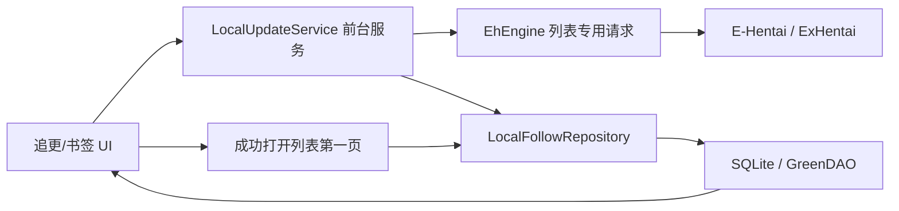

# EhViewer_CN_manbo 文档

> 本文根据当前工作区的 `README.md` 和实际代码整理，重点说明本分支新增的本地追更、书签更新、更新分割线、更新任务、自动拼接中文、JM 号查询及 IGNEOUS 手动刷新。

## 1. 当前项目状态

这是基于 EhViewer 的 Android 客户端，保留原有浏览、搜索、收藏、下载、服务器 Watched 等能力，并在本地增加一套不依赖服务器订阅的追更和更新计数系统。

当前实际构建参数以 `app/build.gradle` 为准：

| 项目 | 当前值 |
| --- | --- |
| Gradle | 9.4.1 |
| Android Gradle Plugin | 9.2.1 |
| Kotlin Android Plugin | 2.2.10 |
| Java / Kotlin JVM Target | 21 |
| compileSdk | 35 |
| targetSdk | 30 |
| minSdk | 23 |
| NDK | 30.0.15729638 |
| namespace | `com.hippo.ehviewer` |
| Release applicationId | `com.ehviewer.manbo` |
| Debug applicationId | `com.ehviewer.manbo.debug` |
| versionName | `2.0.2.14` |
| Release versionCode | 112 |
| Debug versionCode | 139 |
| GreenDAO Schema Version | 11 |

README 的 Build 段已同步为 `2.0.2.13 / 138`。发布、提测、反馈问题时仍应以 `app/build.gradle` 和 `output-metadata.json` 为最终依据喵

项目模块：

- `app`：Android 主应用，绝大多数业务代码都在这里。
- `daogenerator`：GreenDAO 实体代码生成模块。
- `app/src/main/cpp`：图片、压缩包等原生能力及第三方 native 源码。

当前新增功能主要仍采用原项目的 Java/Kotlin + Scene/Fragment UI、OkHttp 3、SQLite/GreenDAO 架构，没有引入 ViewModel、Room 或 WorkManager。

### 1.1 v126 抽屉与书签管理调整

- 追更和书签右侧抽屉统一使用紧凑的更新状态布局：左侧保留 6dp 呼吸空间，34dp 居中数量列完整容纳 `20+`，20dp 状态点列和名称前 4dp 内边距让数量、圆点、名称不再相贴，所有名称仍从同一位置开始。
- 书签名称独占第一行并使用全部剩余宽度，保存的原始查询以 12sp 次要文字颜色显示在第二行，原文空间不足时优先省略；书签行最小高度调整为 56dp。
- 追更名称也改为双行显示：第一行通过标签库动态显示“中文分类:标签译名”，支持艺术家、团队、女性等不同命名空间；标签库暂不可用时会重新尝试获取，并使用 12 种合法 namespace 的本地化资源作为分类兜底。第二行显示用于打开页面和更新扫描的完整原始查询。
- 书签抽屉长按操作框使用自定义标题，标题下方会以同样的 12sp 灰色文字显示原始查询。
- 未检查状态保留空白占位，`0` 使用普通分隔点，正数与 `20+` 使用绿色圆点；异常诊断文字仍在数量列完整显示。
- 书签抽屉长按菜单新增“删除书签”，确认后与齿轮管理页共用 `QuickSearchDeleteHelper`，同时清理书签主记录、更新状态、未读 GID、基线队列和 checkpoint。
- 书签齿轮管理页新增折叠搜索，按名称和保存的查询内容实时过滤；过滤期间隐藏并禁用拖拽，清空搜索后恢复完整列表与排序。
- 搜索无匹配时显示独立空状态，删除过滤结果会同步更新完整数据和过滤结果。

## 2. 代码入口速查

| 功能 | 主要入口 |
| --- | --- |
| 应用初始化 | `app/src/main/java/com/hippo/ehviewer/EhApplication.java` |
| 数据库初始化和迁移 | `app/src/main/java/com/hippo/ehviewer/EhDB.java` |
| 新增表定义 | `app/src/main/java/com/hippo/ehviewer/subscription/SubscriptionSchema.java` |
| 本地追更仓库 | `app/src/main/java/com/hippo/ehviewer/subscription/LocalFollowRepository.java` |
| 更新前台服务 | `app/src/main/java/com/hippo/ehviewer/subscription/LocalUpdateService.java` |
| 更新任务持久化 | `app/src/main/java/com/hippo/ehviewer/subscription/LocalRefreshJobStore.java` |
| 自动基线队列 | `app/src/main/java/com/hippo/ehviewer/subscription/LocalBaselineQueue.java` |
| 全局扫描游标 | `app/src/main/java/com/hippo/ehviewer/subscription/LocalGlobalCursorStore.java` |
| 当前扫描机制说明 | `扫描.md` |
| checkpoint 调整设计 | `checkpoint调整.md` |
| 追更/书签右侧抽屉 | `SubscriptionDraw.java`、`BookmarksDraw.java` |
| 追更管理页 | `LocalFollowScene.java` |
| 统一任务对话框 | `LocalUpdateStartDialog.java`、`LocalUpdateTaskDialog.java`、`LocalUpdateToolbarController.java` |
| 列表打开、分割线、清零 | `GalleryListScene.java` |
| 标签长按菜单 | `GalleryListSceneDialog.kt` |
| 查询 URL 和中文过滤 | `ListUrlBuilder.java` |
| 书签更新规则 | `BookmarkUpdatePolicy.java`、`BookmarkGlobalMatcher.java` |
| 列表专用网络请求 | `EhEngine.getGalleryListForUpdate()` |
| 追更 JSON | `LocalFollowJson.java`、`AdvancedFragment.java` |
| JM 查询 UI | `JmQueryScene.java` |
| JM 网络和协议 | `JmClient.java`、`JmApiCodec.java`、`JmIdParser.java` |
| IGNEOUS 手动刷新 | `IdentityCookiePreference.java`、`IgneousUtils.java` |

## 3. 总体实现结构

新增更新系统分为四层：

1. UI 层发起任务或打开列表。
2. `LocalUpdateService` 串行执行网络检查。
3. `LocalFollowRepository` 和 `SubscriptionRepository` 在事务中提交游标、未读 GID 和计数。
4. `SubscriptionDraw`、`BookmarksDraw`、`GalleryListScene` 重新读取持久化状态并渲染角标或分割线。

核心数据流如下：



必须理解的设计点：

- 更新计数基于 `postedTimestamp + GID`，不是只比较时间，也不是比较列表位置。
- 检查更新的边界和“上次更新到这”的打开边界是两套独立 checkpoint。
- 未读内容按 GID 去重，重复检查不会重复累计。
- 一次任务不是全局事务；已经检查完成的项目会立即提交，后续暂停或失败不会回滚前面的结果。
- 服务全局只允许一个追更、书签或基线任务运行。

## 4. 本地追更

### 4.1 添加和删除

漫画列表和详情页的标签长按最终都会进入 `GalleryListSceneDialog.showTagLongPressDialog()`。菜单中的“追更/取消追更”调用：

- 添加：`LocalFollowRepository.add(tag)`
- 删除：`LocalFollowRepository.remove(tag)`
- 添加成功后：`LocalUpdateService.startPendingBaselines(context)`

本地追更只接受标准 `namespace:value` 标签。允许的 namespace 在 `LocalFollowJson.NAMESPACES` 中，包括：

`artist`、`group`、`parody`、`character`、`female`、`male`、`misc`、`language`、`cosplayer`、`mixed`、`other`、`reclass`。

标签会经过：

- 去除首尾空格；
- 连续空白压缩为一个空格；
- 转成小写；
- 以规范化后的标签名作为主键。

添加时在一个数据库事务中完成：

1. 写入 `LOCAL_FOLLOW_TAG`。
2. 立即写一条 `0` 状态到 `LOCAL_UPDATE_STATE`。
3. 写入 `LOCAL_BASELINE_QUEUE`，等待自动细化基线。
4. 刷新内存中的 `SubscriptionSnapshot`。

因此 UI 不必等待第一次手动检查就能显示 `0`。

删除时会同时清除该标签的：

- 追更主记录；
- 更新状态；
- 未读 GID；
- 更新和打开 checkpoint；
- 待执行的自动基线。

服务器 Watched 与本地追更是两套数据：

- 本地追更来自 `LOCAL_FOLLOW_TAG`，不需要登录。
- 左侧导航的“订阅”仍打开服务器 `/watched` 列表。
- 标签长按中的服务器“订阅/排除”按钮仍通过 E-Hentai 接口工作，并且仅在登录后显示。

右侧原订阅抽屉现在由 `SubscriptionDraw.loadLocalData()` 从本地追更表构造 `UserTagList` 外观数据，不再以服务器 `UserTagList` 作为数据源。`SubscriptionDraw` 中仍留有一部分旧服务器标签请求方法，但当前抽屉入口不会调用它们。

### 4.2 自动基线

“基线”表示从哪个发布时间开始算新增。新条目先建立临时时间基线，再由后台请求细化：

1. `BaselineBoundaryPolicy.provisional()` 取“添加时间的下一整秒”作为临时水位。
2. `LocalBaselineQueue` 持久化待处理项目。
3. `LocalUpdateService` 读取第一页，寻找不晚于添加时刻的最新完整时间组。
4. 同一秒的所有 GID 必须一起进入边界，防止漏计同秒结果。
5. 如果目标时间组正好顶到页面末尾，无法证明该秒已经完整，保留更安全的临时时间基线。

基线方法：

| 场景 | 方法 | 实际行为 |
| --- | --- | --- |
| 单个新追更 | `FOLLOW_TAG` | 请求该标签第一页 |
| JSON/数据库批量导入追更 | `FOLLOW_GLOBAL` | 同批项目共享一页全局中文结果 |
| 新书签 | `BOOKMARK` | 请求该书签自己的第一页 |

网络失败会最多尝试 3 次。无法细化时队列状态变为 `FALLBACK`，保留添加时刻基线，不把任务无限卡住。

### 4.3 追更列表显示

右侧追更列表由 `SubscriptionDraw` 渲染：

- 状态未初始化时只显示标签名。
- 基线建立后显示 `0`。
- 有新增时显示 `1–20` 或 `20+`。
- 正数和 `20+` 使用绿色 `●`，零使用普通 `·`。
- 排序先按更新数降序，再按 `checkedAt` 降序，最后按标签名排序。

追更设置按钮进入 `LocalFollowScene`，该页面只提供搜索和删除，不提供直接输入标签添加。正常添加入口仍是列表或详情页的标签长按。

## 5. 更新计数算法

### 5.1 边界模型

`FeedBoundary` 包含：

- `time`：Unix 秒；
- `gids`：该秒已经存在的全部 Gallery ID。

判断规则：

- `postedTimestamp > time`：新内容。
- `postedTimestamp == time` 且 GID 不在边界集合：新内容。
- `postedTimestamp < time`：旧内容。
- `postedTimestamp == time` 且 GID 已在边界集合：旧内容。

只保存时间会漏掉服务器稍后索引、但发布时间处于同一秒的画廊，因此同秒 GID 集合不能删。

### 5.2 数据完整性

更新任务不直接使用普通浏览请求，而调用 `EhEngine.getGalleryListForUpdate()`：

- 不应用用户本地的标题、上传者、标签过滤器；
- 从列表 HTML 读取结果；
- 若 `simpleTags`、发布时间、分类、上传者、页数或评分不完整，再调用 `gdata` 补齐；
- `gdata` 每批最多 25 个；
- 返回的 `GalleryInfo` 才用于本地匹配和计数。

普通浏览设置的请求间隔不会影响这里；更新间隔也只在发出“搜索列表请求”前等待，不额外限制同一列表请求触发的 `gdata` 补全。

### 5.3 未读去重和 `20+`

每个来源的新 GID 写入 `LOCAL_UNREAD_GALLERY`，主键为：

`SOURCE_TYPE + SOURCE_KEY + GID`

所以同一个画廊在多轮检查中只计一次。每个来源最多保留最近 21 条未读 GID：

- 0–20 条可精确显示。
- 达到 21 条或扫描无法覆盖旧边界时显示 `20+`，状态为 `LOWER_BOUND`。
- `TagUpdateState` 对外显示时把数值封顶为 20，是否为下界由 `COUNT_STATE` 区分。

### 5.4 全局中文扫描

追更的 `GLOBAL` 方法：

1. 构造无关键词普通搜索并强制中文条件。
2. 从最新结果开始，最多读取高级设置中的页数上限，范围为 1–300 页且默认 30 页。
3. 每个 Gallery 的 `simpleTags` 在本地与所有追更标签匹配。
4. 扫描越过上次 `LOCAL_GLOBAL_CURSOR` 后停止。
5. 必须继续读到比游标时间更旧的内容，同秒内不能提前停止。
6. 扫描完整时，为所有标签提交本轮匹配结果并统一前移到本轮顶部边界。
7. 达到设置的页数上限仍未越过游标时，降级为每个标签单独检查第一页。

第一次在某个“账号 + 站点”来源上运行全局扫描只建立零基线，不把已有结果算作新增。由旧版本升级且没有独立全局游标时，会用所有单项 checkpoint 中最旧的边界启动一次迁移。

### 5.5 逐标签第一页

追更的 `TAGS` 方法逐个构造标签搜索：

1. 请求该标签第一页。
2. 与该标签自己的 `LOCAL_FOLLOW_SYNC` checkpoint 比较。
3. 边界在第一页内时精确累计新 GID。
4. 第一页未覆盖旧边界时标记为 `20+`，不假装得到精确数量。

可重试的网络异常会进行两轮延时重试。某个项目最终失败会保留失败列表，任务整体显示失败；已成功项目不会回滚。

### 5.6 checkpoint、检查时间与 `globalTop`

这里有三种容易混淆的“时间”：

- 同步 checkpoint 是内容覆盖边界，保存 Gallery 的 `postedTimestamp` 和该秒已经见过的 GID，不是任务执行时的系统时间。
- `LOCAL_UPDATE_STATE.CHECKED_AT` 和追更标签的 `LAST_CHECKED_AT` 才表示这次实际完成检查的时间。即使结果为空、同步 checkpoint 没有前移，检查时间仍会更新。
- `UPDATED_AT` 只表示数据库记录的写入时间，也不能用于判断 Gallery 新旧。

普通逐标签检查取得的是“该标签结果顶部”，即该标签第一页最新一部 Gallery 的发布时间和同秒 GID。假设 12:00 执行检查，标签第一页最新结果发布于 10:00，那么同步 checkpoint 写 10:00，实际检查时间写 12:00。不能把同步 checkpoint 直接写成 12:00；否则一部发布于 11:00、但因标签索引延迟而在稍后才进入搜索结果的 Gallery，会被下一轮错误判为旧内容。

`globalTop` 是本轮无关键词中文全局列表第一页的顶部边界，同样由最新 Gallery 的 `postedTimestamp + 同秒 GID` 组成。例如任务在 12:00 执行，而全局列表最新 Gallery 发布于 11:58，则 `globalTop` 是 11:58 的内容边界，不是 12:00。`globalTop` 在任务中先是一个内存变量，提交成功后会写到两类不同记录：

1. 每个追更标签或书签仍有各自独立的 `FEED_CHECKPOINT`，唯一键中的 `SOURCE_KEY` 分别是标签名或书签 ID。完整全局扫描证明一段全局列表已经覆盖后，这些独立记录可以拥有相同的 `globalTop` 值，但它们不是同一条记录。
2. `LOCAL_GLOBAL_CURSOR` 才是同一“账号 + 站点 + 任务类型 + 查询签名”共用的全局扫描停止游标。下一轮从新的全局顶部向后读取，越过这条共享游标即可停止，不需要逐个寻找低频标签自己的旧 checkpoint。

首次没有 `LOCAL_GLOBAL_CURSOR`、但已经存在单项 checkpoint 时，代码会临时取所有单项 checkpoint 中最旧的边界作为一次性迁移起点。迁移完成或达到设置的页数上限后成功执行降级队列，都会写入本轮共享全局游标；之后的全局扫描以共享游标为准。因此长期没有新内容的标签可能让首次迁移扫描较深，但不会仅因自己的 checkpoint 很旧而让以后每一轮都降级。

各更新路径的同步边界如下：

| 更新路径 | 成功后如何处理同步 checkpoint | 共享全局游标 |
| --- | --- | --- |
| 普通追更 `TAGS` | 非空结果推进到该标签第一页顶部；空结果不推进，只更新检查时间；第一页未覆盖旧边界时仍推进到标签顶部，但计数标记为 `20+` | 不读写 |
| 追更 `GLOBAL` 首次建立来源 | 所有标签分别以 `globalTop` 建立零基线，不把现有结果计为新增 | 写入 `globalTop` |
| 追更 `GLOBAL` 完整越过旧共享游标 | 每个标签分别用自己的匹配结果计算新增，但同步 checkpoint 全部推进到同一个 `globalTop`；没有匹配结果的标签也推进 | 写入 `globalTop` |
| 追更 `GLOBAL` 达到设置的页数上限仍未越过旧共享游标 | 自动逐标签检查第一页；各标签按普通 `TAGS` 规则推进，空结果仍不推进 | 降级队列全部成功后写入本轮 `globalTop`，所以下一轮不再追逐这些单项旧边界 |
| 普通逐书签检查或 `SINGLE:<id>` | 非空结果推进到该书签第一页顶部；空结果不推进，只更新检查时间；未覆盖旧边界时标记为 `20+` | 不读写 |
| 书签 `GLOBAL` 中可精确本地匹配且扫描完整 | 首次来源以 `globalTop` 建立零基线；后续用各书签匹配结果计算新增，并把各自 checkpoint 推进到同一个 `globalTop` | 写入 `globalTop` |
| 书签 `GLOBAL` 的旧边界桥接或页数上限降级 | 逐书签第一页负责补算；只要本轮取得了非空 `globalTop`，成功提交时就同步推进到该 `globalTop`。若所有项目都在扫描前进入桥接、没有实际取得全局顶部，则退回普通逐书签规则 | 有完整的本轮全局顶部时按全局流程写入 |
| 书签 `GLOBAL` 中无法精确本地匹配的复杂查询 | 自动逐书签请求，但保持普通逐书签的独立顶部，不借用 `globalTop` | 不由该降级项改变 |

自动基线不是一次普通更新。新增追更或书签时先以添加时刻建立临时边界，后台任务再尽量细化为“对应列表第一页中不晚于添加时刻的最新 Gallery 边界”；细化使用 `establishCheckpoint()`，不会制造一次虚假的 previous/current 更新历史。

`LOCAL_FOLLOW_SYNC`、`BOOKMARK_SYNC` 与 `LOCAL_FOLLOW_OPEN`、`BOOKMARK_OPEN` 是两套独立 checkpoint。上表中的检查更新路径只写 `*_SYNC`；只有用户成功打开对应列表第一页且结果非空时，才把该页顶部写入 `*_OPEN`。因此检查更新、`globalTop` 和共享全局游标都不会移动“上次更新到这”分割线，具体打开流程见第8节。

## 6. 书签更新

书签就是原项目的 `QuickSearch`。新增书签时，`EhDB.insertQuickSearch()` 在同一事务中调用 `LocalFollowRepository.initializeBookmark()`，立即写 `0` 和自动基线队列。

### 6.1 查询签名

书签状态不能只用名称识别。`BookmarkUpdatePolicy.querySignature()` 对以下字段生成 SHA-256 签名：

- mode；
- category；
- keyword；
- advanceSearch；
- minRating；
- pageFrom；
- pageTo；
- 固定中文策略标记。

重命名不改变签名，因此保留状态；查询条件改变后，`prepareBookmarkSignature()` 会清掉旧状态、未读 GID 和 checkpoint，重新建立零基线。

### 6.2 支持范围

可更新的 mode：

- 普通搜索 `MODE_NORMAL`
- 标签 `MODE_TAG`
- 上传者 `MODE_UPLOADER`
- 过滤搜索 `MODE_FILTER`

明确指定非中文正向语言条件时返回 `language conflict`；热门、图片搜索、榜单等特殊 mode 返回 `unsupported mode`。这类书签不发更新请求，书签抽屉显示原因而不是误导性的 `0`。

### 6.3 书签全局匹配

`BookmarkGlobalMatcher` 只在能够用 `GalleryInfo` 精确重现条件时参加共享全局扫描。

可以本地精确匹配的条件包括：

- 标签模式下的单个标准标签，保存时没有 `$` 也按精确标签处理；
- 上传者模式；
- 普通/过滤搜索中的标准正向或负向标签，无论有没有 `$`；
- 多个标准标签组成的普通 AND 查询；
- 带引号的标准标签值，例如 `female:"big breasts"` 或 `female:"big breasts"$`；
- 正向 uploader；
- 分类、最低评分、最少/最多页数。

以下情况自动降级为逐书签请求：

- 不带命名空间的普通全文关键词，包括带 `$` 的裸词，例如 `bbw`、`bbw$`；
- 标准标签与普通全文关键词混合的查询；
- `OR`、`~` 等复杂操作符；
- 通配符、模糊表达式；
- 负向 uploader；
- 不支持的命名空间；
- 无法从 `GalleryInfo` 精确判断的字段。

标准命名空间来自 `LocalFollowJson`，当前包括：

`artist`、`group`、`parody`、`character`、`female`、`male`、`misc`、`language`、`cosplayer`、`mixed`、`other`、`reclass`。

`$` 只表示用户显式指定精确匹配，不再是识别标准命名空间标签的必要条件。代码不会修改书签原关键词、补写 `$` 或改变查询签名。

共享扫描流程与追更类似，也使用高级设置中的共享页数上限，并使用书签自己的 `LOCAL_GLOBAL_CURSOR`。精确书签共享扫描结果；复杂书签和未覆盖游标的书签随后进入逐书签队列。

v120 增加了旧边界衔接保护：如果一个原先会降级、现在可以全局匹配的书签，其单项 checkpoint 早于共享全局游标，则不能直接使用只扫描到共享游标的结果。`LocalUpdateService.selectGloballyCovered()` 会先把该书签放入一次性的逐书签第一页队列；第一页提交后再参加后续快速全局扫描。衔接和全局结果仍通过 `LOCAL_UNREAD_GALLERY` 按 GID 去重，不会重复累计，也不会改动 `*_OPEN` 分割线边界。

### 6.4 书签 UI

`BookmarksDraw` 提供：

- 工具栏刷新：选择全局中文扫描或逐书签检查；
- 长按某条书签：只检查该书签；
- 更新角标和绿色圆点；
- 更新数降序；
- 相同更新数保持抽屉创建时记录的原手动顺序。

单条书签任务的方法名持久化为 `SINGLE:<id>`，不会更新内部的“整栏书签最后成功检查时间”；该时间继续用于扫描方式推荐，更新启动弹窗改为显示当前账号与站点对应的 `LOCAL_GLOBAL_CURSOR.CURRENT_TIME`，也就是下一次全局扫描实际使用的停止边界。

删除书签时，`QuickSearchScene` 除删除 `QuickSearch` 外，还异步清除本地书签状态、未读 GID、自动基线和相关 checkpoint。

## 7. 更新任务、暂停和请求间隔

### 7.1 任务类型和状态

`LocalUpdateService` 是声明为 `foregroundServiceType="dataSync"` 的前台 Service。

任务类型：

| 类型 | 方法 |
| --- | --- |
| `FOLLOW` | `GLOBAL`、`TAGS` |
| `BOOKMARK` | `GLOBAL`、`FIRST_PAGE`、`SINGLE:<id>` |
| `BASELINE` | `AUTO` |

阶段：

- `PREPARING`
- `GLOBAL_SCAN`
- `FOLLOW_QUEUE`
- `BOOKMARK_QUEUE`
- `BASELINE`

状态：

- `RUNNING`
- `PAUSED`
- `SUCCESS`
- `FAILED`
- `CANCELLED`

`AtomicBoolean ACTIVE` 保证同一进程只能启动一个任务。所有任务状态保存在单行表 `LOCAL_REFRESH_JOB`，历史成功时间和最近一次结果保存在 `LOCAL_REFRESH_META`。

### 7.2 暂停、继续、停止

暂停或停止会：

1. 设置内存标记。
2. 取消当前 OkHttp `Call`。
3. 中断工作线程。
4. 把任务状态写为 `PAUSED` 或 `CANCELLED`。

继续行为：

- 逐标签/逐书签从已持久化的 index 继续。
- 全局扫描重新从全局第一页开始，避免复用不完整的跨页内存结果。
- 基线从持久化队列的未完成项继续。

应用进程启动时，`EhApplication` 调用 `LocalRefreshJobStore.recoverInterruptedJob()`，把上次遗留的 `RUNNING` 改为 `PAUSED`，并把基线队列的 `RUNNING` 改回 `PENDING`。

停止不是回滚：任务此前已经提交的更新计数仍然保留。基线任务被停止时，尚未执行的队列项会标为 `CANCELLED`。

### 7.3 状态展示

追更和书签使用同一个 `LocalUpdateToolbarController`：

- 运行中旋转刷新图标；
- 全局扫描显示页数和 Gallery 数；
- 单项队列显示当前序号、总数和项目名；
- 空闲时显示上次成功、部分成功、失败或停止时间。

点击运行中/暂停中的刷新按钮会打开 `LocalUpdateTaskDialog`。对话框显示：

- 类型、方法、阶段；
- 当前来源 host；
- 本任务固定的请求间隔；
- 项目进度；
- 扫描页数和 Gallery 数；
- 成功数、`20+` 数和失败项；
- 暂停、继续、重试或停止操作。

Android 13 及以上会在开始任务前申请通知权限。即使业务任务是手动发起，Service 仍按前台服务运行。

### 7.4 请求间隔

设置入口为“设置 → 高级 → 更新检查请求间隔”。

`SearchIntervalPolicy` 规则：

- 默认 3200 ms；
- 最小 1000 ms；
- 最大 10000 ms；
- 只允许最多一位小数；
- 小于 3000 ms 需要二次确认。

每个任务创建时把间隔快照写入 `LOCAL_REFRESH_JOB.REQUEST_INTERVAL_MS`。暂停后继续同类型、同方法任务时继续使用原间隔；设置修改只影响新任务。

该间隔只控制 `LocalUpdateService.fetchPage()` 前的搜索列表请求，不控制普通浏览、详情、图片或独立网络模块。

### 7.5 E/EX 来源切换

更新任务会根据 `igneous` 选择来源：

- `igneous` 可用时优先 `exhentai.org`；
- 无效、空或 `mystery` 时使用 `e-hentai.org`；
- EX 请求失败时会尝试 E；
- 全局扫描发生 host 切换后会清空本轮内存结果并按新 host 重新开始。

同步 checkpoint 和全局游标的上下文为：

`accountKey + "|" + host`

这样 E 和 EX、不同登录账号的搜索边界不会直接混用。

## 8. “上次更新到这”分割线

### 8.1 两套边界

更新检查边界：

- 追更：`LOCAL_FOLLOW_SYNC`
- 书签：`BOOKMARK_SYNC`

打开列表边界：

- 追更：`LOCAL_FOLLOW_OPEN`
- 书签：`BOOKMARK_OPEN`

更新检查只改前一套，用户成功打开列表第一页才改后一套，所以检查更新不会移动当前分割线。

打开边界使用固定账号键 `shared`，即该分割线设计为设备共享，不随 EH 账号变化。更新检查边界则按账号和 host 分开。

### 8.2 打开列表时的流程

从追更或书签抽屉进入列表时：

1. `GalleryListScene` 记录当前来源和查询签名。
2. 读取进入前的打开边界，交给 `FeedBoundaryDecoration`。
3. 记录此时该来源最大的未读表 rowid。
4. 列表第一页成功且非空后，保存本次第一页顶部边界。
5. 只删除进入列表前已经存在的未读 GID。
6. 检查期间新插入、rowid 更大的未读 GID 保留。
7. 当前界面继续显示进入前加载的旧边界，新边界下次进入才显示。

`FeedBoundaryDecoration` 找到第一个被边界判定为“旧内容”的列表项，在它上方绘制带文字的横线。

只有以下来源显示分割线：

- 服务器 Watched 聚合；
- 本地追更标签；
- 书签。

首页和临时搜索不显示。

### 8.3 服务器 Watched 的当前偏差

代码仍为服务器 Watched 聚合注册了 `SUBSCRIPTION_AGGREGATE` 分割线，并保留：

- `EhEngine.scanSubscriptions()`；
- `GalleryListScene.finishSubscriptionScan()`；
- `SUBSCRIPTION_TAG_CACHE` 和 `SUBSCRIPTION_TAG_UPDATE_STATE`。

但当前右侧刷新按钮已改为启动本地追更 `LocalUpdateService`，全仓库没有找到对 `METHOD_SCAN_SUBSCRIPTIONS` 或 `finishSubscriptionScan()` 的实际发起调用。服务器 Watched 成功打开列表时，`handleSuccessfulFeed()` 也只提交本地追更和书签，不提交聚合打开边界。

因此当前代码中“服务器 Watched 聚合页使用分割线”属于保留但未完整接通的旧实现；已有历史 checkpoint 的设备可能继续显示，fresh install 不能靠当前 UI 建立这条边界。若要兑现 README，需要重新确定服务器 Watched 是按“扫描更新”还是按“成功打开”推进边界，并恢复对应调用链。

## 9. 自动拼接中文

左侧抽屉开关由：

- `MainActivity`
- `Settings.KEY_AUTO_APPEND_CHINESE`
- `ListUrlBuilder.build(boolean autoAppendChinese)`

共同实现。

支持模式：

- 普通搜索；
- 服务器 Watched 搜索；
- 标签搜索；
- 上传者搜索；
- 过滤搜索。

转换规则：

- 普通搜索在关键词后加 `l:chinese`。
- 空关键词直接变为 `l:chinese`。
- 标签路径搜索会改写为精确标签搜索，再加中文条件。
- 上传者路径搜索会改写为 `uploader:"..." l:chinese`。
- 高级搜索启用中文时强制打开标签搜索位。
- 已有正向 `l:`、`lang:`、`language:` 条件时不重复添加，也不会替换原语言。
- 只构造有效 URL，不修改 `ListUrlBuilder` 中保存的原关键词和 mode。

追更和可更新书签在检查及打开时调用 `build(true)`，不依赖用户开关；普通浏览使用 `Settings.getAutoAppendChinese()`。

需要注意一个实际边界情况：本地追更允许添加 `language:japanese` 等语言标签，但 `ListUrlBuilder` 检测到已有正向语言条件后不会再拼中文。全局扫描仍只扫描中文，而逐标签和打开列表可能按该非中文语言标签请求。这与 README 中“追更始终固定中文”的表述不完全一致。若产品要求严格固定中文，应禁止追更非中文 `language:*`，或定义语言标签与中文过滤冲突时的统一行为。

## 10. 追更 JSON 导入导出

入口位于“设置 → 高级”：

- 导出使用 Storage Access Framework 的 `ACTION_CREATE_DOCUMENT`；
- 导入使用 `ACTION_OPEN_DOCUMENT`；
- 文件编码固定 UTF-8；
- 默认文件名 `ehviewer-local-follows.json`。

格式版本为 1，示例：

```json
{
  "format": "ehviewer.local-follow-tags",
  "version": 1,
  "exportedAt": "2026-07-27T12:00:00+08:00",
  "count": 2,
  "tags": [
    "artist:foo",
    "female:bar"
  ]
}
```

导入时会：

1. 校验 `format` 和 `version`。
2. 规范化标签。
3. 跳过非法标签和重复项，并在预览中报告数量。
4. 让用户选择合并或替换全部。
5. 为新增项批量写入自动基线队列。
6. 启动待处理基线任务。

替换模式会删除不在导入文件中的追更及其计数、未读和 checkpoint。

普通数据库导入和 Wi-Fi 接收书签也已接入相应的自动基线初始化。

## 11. JM 号查询

### 11.1 UI 和输入

左侧导航的“JM号查询”打开单例 `JmQueryScene`。

`JmIdParser` 实际支持：

- 纯数字；
- `JM12345`；
- 包含 `/photo/`、`/photos/`、`/album/`、`/albums/` 的链接；
- `?id=12345` 链接。

前导零会被去掉，0 无效。

页面显示：

- 漫画名、JM 号、封面；
- 作者、标签、作品、角色；
- 页数、浏览、点赞、评论；
- 简介和章节；
- 复制标题；
- 浏览器打开。

查询结果只在 Scene 状态中用于配置变更恢复，没有写入历史数据库。

### 11.2 网络协议

`JmClient.query()` 依次尝试硬编码的 API 域名：

1. 请求 `/setting`，读取服务端 `jm3_version`。
2. 请求 `/album?id=<id>`。
3. 请求头用当前秒级时间戳生成 `token` 和 `tokenparam`。
4. `token = MD5(timestamp + SECRET)`。
5. 返回 `data` 先 Base64 解码，再用 `AES/ECB/PKCS5Padding` 解密。
6. API 都失败后，通过短链发现当前网页域名，并用 Jsoup 解析网页，结果标为 `partial`。

封面单独依次尝试多个图片 CDN，路径为 `/media/albums/<id>.jpg`。封面请求失败只保留占位图，不影响文字结果。

查询、封面、网页地址分别使用可取消的 `JmClient`。`JmQueryScene` 用 generation 编号忽略旧请求回调，并在页面销毁时取消 Future 和 OkHttp Call。

### 11.3 Cookie 隔离

JM 客户端从应用共享 OkHttpClient 复制基础配置，但：

- 替换为内存 CookieJar；
- 禁用缓存；
- 清空会把 EH Cookie 同步到 WebView 的 network interceptor；
- 不读取或修改 EH Cookie 数据库。

JM 的 API 域名、加密常量、网页 DOM 和图片 CDN 都属于易变外部协议。服务不可用时优先检查这些常量和返回格式，不要先改 EH 登录逻辑。

## 12. 登录、IGNEOUS 与手动刷新

### 12.1 登录状态

EH 登录由 `EhCookieStore` 中的：

- `ipb_member_id`
- `ipb_pass_hash`
- `igneous`

维护。`Settings.isLogin()` 主要依据前两个身份 Cookie；进入 EX 还要求可用的 `igneous`。

`IgneousUtils.isUsableIgneous()` 把空值和 `mystery` 判为不可用。更新任务也用这个规则决定优先访问 EX 还是 E。

### 12.2 手动刷新 IGNEOUS

“设置 → EH → 身份 Cookie”对话框的中性按钮调用 `IdentityCookiePreference.refreshIgneous()`：

1. 防止重复点击。
2. 用 `IgneousUtils.buildRefreshRequest()` 构造 EX `uconfig` 请求。
3. 可选添加设置中的 `CF-Connecting-IP`。
4. 请求前删除 OkHttp 和 WebView 中旧的 `igneous`。
5. 使用应用共享 OkHttpClient 异步请求。
6. 请求结束后读取 CookieJar 中的新值。
7. 只有非空且非 `mystery` 才视为成功，否则再次删除。
8. 根据网络错误、HTTP 错误、无效 Cookie或成功显示提示。

`CF-Connecting-IP` 仅在 `cf_auto_retry` 开关打开时用于这次手动刷新，配置值必须是合法 IPv4 或 IPv6。该 key 名带有 `auto_retry`，但当前实际行为不是全局自动重试。

应用把服务端 `igneous=mystery` 同步到 WebView 时会跳过该 Cookie，但 OkHttp CookieJar 本身仍可能接收响应 Cookie；最终可用性判断不能只看 Cookie 是否存在。

README 已注明“开启代理后获取失败”仍未解决。手动刷新使用共享 OkHttpClient，因此仍会经过应用代理配置；若代理出口和登录会话不一致，可能继续得到 `mystery`。当前建议仍是保持稳定欧美节点重新登录，或关闭应用代理后手动刷新。

### 12.3 应用版本手动检查

如果 README 中“加入手动刷新”指应用更新检查，对应入口是“设置 → 更新与支持 → 检查更新”。`AboutFragment` 调用 `AppUpdater.update(activity, true)`，与追更更新和 IGNEOUS 刷新无关。

## 13. 数据库表

新增表由 `SubscriptionSchema` 创建，数据库版本为 11。

| 表 | 用途 |
| --- | --- |
| `LOCAL_FOLLOW_TAG` | 设备本地追更标签、添加时间、最后检查时间 |
| `SUBSCRIPTION_TAG_CACHE` | 服务器标签快照；旧服务器聚合扫描使用 |
| `FEED_CHECKPOINT` | 所有同步和打开边界，保存 previous/current 时间与同秒 GID |
| `SUBSCRIPTION_TAG_UPDATE_STATE` | 旧服务器聚合扫描的逐标签计数 |
| `LOCAL_UPDATE_STATE` | 本地追更/书签的计数、状态、检查时间和错误 |
| `LOCAL_UNREAD_GALLERY` | 本地追更/书签按 GID 去重的未读记录 |
| `LOCAL_GLOBAL_CURSOR` | 追更或书签共享全局中文扫描游标 |
| `LOCAL_REFRESH_JOB` | 当前/最近一次任务的单行快照 |
| `LOCAL_REFRESH_META` | 上次完整成功和最近任务结果 |
| `LOCAL_BASELINE_QUEUE` | 自动基线持久化队列 |

另外书签主体仍在 GreenDAO 的 `QUICK_SEARCH` 表。

表之间没有声明 SQLite 外键，删除关联状态依赖仓库方法手工完成。新增删除入口时必须复用仓库方法，不能只删主表。

### 13.1 checkpoint 键

`FEED_CHECKPOINT` 唯一键为：

`ACCOUNT_KEY + SOURCE_TYPE + SOURCE_KEY + QUERY_SIGNATURE`

常见 `SOURCE_TYPE`：

- `LOCAL_FOLLOW_SYNC`
- `BOOKMARK_SYNC`
- `LOCAL_FOLLOW_OPEN`
- `BOOKMARK_OPEN`
- `SUBSCRIPTION_AGGREGATE`
- 兼容旧版本的 `SUBSCRIPTION_TAG_SEEN`、`QUICK_SEARCH`

`advanceCheckpoint()` 把旧 current 移到 previous，再写新 current；`establishCheckpoint()` 只细化 current，不制造 previous。这一区别决定第一次建立基线时是否错误显示分割线。

### 13.2 账号范围

当前实际范围并不完全一致：

- 追更标签和书签：设备全局。
- `LOCAL_UPDATE_STATE` 和 `LOCAL_UNREAD_GALLERY`：设备全局。
- 更新 checkpoint 和全局游标：账号 + E/EX host。
- 打开分割线 checkpoint：固定 `shared`，跨账号共享。

切换账号或站点时，计数仍可能沿用设备全局状态，但缺失的来源 checkpoint 会以状态时间建立临时边界。这是当前实现，不要误以为所有更新状态都按账号隔离。

## 14. 构建和验证

### 14.1 Windows 构建

```powershell
.\gradlew.bat :app:assembleAppReleaseDebug
```

APK：

```text
app/build/outputs/apk/appRelease/debug/app-appRelease-debug.apk
```

确认构建身份：

```powershell
Get-Content app\build\outputs\apk\appRelease\debug\output-metadata.json
```

应看到：

- `applicationId = com.ehviewer.manbo.debug`
- `versionName = 2.0.2.9`
- `versionCode = 134`
- `variantName = appReleaseDebug`

### 14.2 单元测试

运行全部 appReleaseDebug 单元测试：

```powershell
.\gradlew.bat :app:testAppReleaseDebugUnitTest --no-daemon --no-problems-report --max-workers=1
```

新增功能重点测试：

- `subscription/SubscriptionCoreTest`
- `subscription/SubscriptionUpdateCalculatorTest`
- `subscription/SubscriptionSchemaTest`
- `subscription/BaselineBoundaryPolicyTest`
- `subscription/GlobalScanPolicyTest`
- `subscription/LocalGlobalCursorStoreTest`
- `subscription/BookmarkUpdatePolicyTest`
- `subscription/LocalFollowJsonTest`
- `subscription/LocalRefreshJobStoreTest`
- `subscription/SearchIntervalPolicyTest`
- `subscription/UpdateBadgeFormatterTest`
- `ui/scene/gallery/list/QuickSearchFilterTest`
- `client/data/ListUrlBuilderChineseFilterTest`
- `client/parser/PostedTimestampTest`
- `client/IgneousUtilsTest`
- `jm/JmIdParserTest`
- `jm/JmApiCodecTest`
- `jm/JmAlbumMappingTest`

本次 v120 修改验证执行了 12 个订阅相关测试类，包括 `BookmarkUpdatePolicyTest`、`GlobalScanPolicyTest`、`LocalGlobalCursorStoreTest` 和 `SearchIntervalPolicyTest`：共 53 个测试，0 failure、0 error、2 skipped，Gradle 任务 `BUILD SUCCESSFUL`。新增覆盖所有标准命名空间有无 `$`、带引号标签、多标签、否定标签、裸词降级和旧边界衔接判断。

单元测试不能覆盖真实站点限流、EX Cookie、JM 域名漂移、前台服务进程回收和 Android 通知权限，发版前仍需真机验证。

### 14.3 v120 APK 与实机状态

2026-07-27 已完成：

- 构建任务：`:app:assembleAppReleaseDebug`
- APK：`app/build/outputs/apk/appRelease/debug/app-appRelease-debug.apk`
- applicationId：`com.xjs.ehviewer.debug`
- versionName：`2.0.2.4`
- versionCode：`120`
- SHA-256：`20B6B1DCBF465504832F61032B81FA8E1AA19E808FF4F6FD602CCD250E365340`
- 已通过 `adb install -r` 覆盖安装到设备 `5da3329`（`24117RK2CC`），保留调试版数据。
- 冷启动后进程 PID 为 `3444`，检查当次进程日志未发现 `FATAL EXCEPTION`。
- 正式版 `versionCode` 仍为 `112`，本次没有构建或安装正式版。

### 14.4 v126 抽屉与书签管理验证

2026-07-28 已完成：

- 相关回归测试首次执行 10 个测试类，共 50 个测试，0 failure、0 error、2 skipped。
- 根据实机截图压缩数量区域并增加灰色原始查询后，最终执行 `UpdateBadgeFormatterTest` 和 `QuickSearchFilterTest`，共 11 个测试，0 failure、0 error、0 skipped。
- v125 执行 `FollowLabelFormatterTest`、`UpdateBadgeFormatterTest` 和 `QuickSearchFilterTest`，共 18 个测试，0 failure、0 error、0 skipped。
- v126 增加无标签数据库时的本地化 namespace 兜底测试后，共执行 19 个相关测试，0 failure、0 error、0 skipped。
- `:app:assembleAppReleaseDebug` 构建成功，输出元数据为 `com.xjs.ehviewer.debug / 2.0.2.4 / 126`。
- APK：`app/build/outputs/apk/appRelease/debug/app-appRelease-debug.apk`
- SHA-256：`7CCCBFD61110EBA98340E116A3068257D1E22D08ABCFC05552522F4F160E6C6B`
- 新增资源 ID 后必须执行一次干净全量构建；否则 `android.nonFinalResIds=false` 下可能复用仍引用旧 ID 的 Kotlin 字节码，表现为 `LimitsCountView.init()` 在启动时空指针。
- v122 曾执行 `clean :app:assembleAppReleaseDebug` 以恢复 Kotlin、Java 与资源 ID 同步；后续构建也实际重新执行了 Kotlin 和 Java 编译，再通过 `adb install -r` 覆盖安装到设备 `5da3329`，设备端确认 debug `versionCode=126`。
- 干净 APK 启动后进入 `MainActivity`，进程在等待 5 秒后仍存活，清空后重新读取的 crash buffer 中没有新增异常。
- 正式版 `com.xjs.ehviewer` 未构建、未安装、未检查。
- v126 最终布局安装后设备处于黑屏锁定状态，仍需在解锁状态下确认数量居中、追更中文分类兜底与灰色原始查询第二行。

### 14.5 v127 下载连续阅读与精确自动翻页验证

2026-07-28 已完成以下代码与本机构建验证喵：

- 下载页按当前搜索、筛选和排序后的完整 `mList` 生成 GID 队列，普通点击和随机阅读共用同一入口喵。
- 阅读终点需要再次向后翻才推进队列，纵向模式仅在手势开始时已处于底部才响应，顶部不会误触发喵。
- 后续下载记录会在后台检查，失效记录、本地无可读图片和不可访问的压缩包会跳过并提示数量，队列结束会停留在末本并停止自动翻页喵。
- 跨书切换使用无动画结果转发，自动翻页状态、队列位置和起始位置随 Intent 传递，返回下载页后刷新已遍历范围的阅读进度喵。
- 自动翻页间隔改为 `500–5000 ms`，滑动条步长为 `100 ms`，阅读器长按菜单和阅读设置共用同一控件、格式化与校验逻辑喵。
- 数字输入支持 `0.5–5.0` 且最多一位小数，非法输入就地显示错误，阅读器对话框在修正前不会关闭喵。
- 旧 `start_transfer_time` 整数秒设置按原显示值迁移并收敛到新范围，调度器首次和后续等待都使用同一真实毫秒间隔，运行中确认新值会立即重建调度器喵。
- `AutoTransferIntervalTest` 与 `DownloadReadingQueueTest` 共 10 个测试通过，覆盖 `0.5`、`0.6`、`2.3`、`5.0`、非法输入、迁移、步长映射、队列顺序、异常跳过和末项停止喵。
- `:app:compileAppReleaseDebugJavaWithJavac` 与 `:app:assembleAppReleaseDebug` 均构建成功，输出元数据为 `com.xjs.ehviewer.debug / 2.0.2.4 / 127` 喵。
- APK：`app/build/outputs/apk/appRelease/debug/app-appRelease-debug.apk` 喵。
- SHA-256：`9928DF5EFEB7808708972CE104CD1DB7E69D0F10BCB9AA624350ECD91FA047A6` 喵。
- 当前 `adb devices -l` 未检测到设备，因此尚未覆盖安装，也未完成下载队列、各翻页输入方式和明暗主题的真机交互回归喵。
- 本次不涉及更新扫描逻辑，未修改 `扫描.md` 喵。

### 14.6 v128 自动下一本退出修复

2026-07-29 已完成以下修复与验证喵：

- 真机事件日志确认 v127 在跨书时对 `singleTask` 的 `GalleryActivity` 发送了 `wm_new_intent`，随后旧代码调用 `finish()`，任务栈因此恢复到下载页喵。
- 保留普通 `GalleryActivity` 的 `singleTask` 和外部入口，新增不导出的 `DownloadGalleryActivity`，以 `standard` 模式专门承载下载队列喵。
- 下载页普通点击和随机阅读均启动下载专用 Activity，跨书 Intent 继续启动当前运行时类型并使用 `FLAG_ACTIVITY_FORWARD_RESULT`，不改变队列数据格式喵。
- `DownloadGalleryActivityTest`、`AutoTransferIntervalTest` 与 `DownloadReadingQueueTest` 共 11 个测试通过，0 failure、0 error、0 skipped 喵。
- `:app:compileAppReleaseDebugJavaWithJavac` 与 `:app:assembleAppReleaseDebug` 均构建成功，输出元数据为 `com.xjs.ehviewer.debug / 2.0.2.4 / 128` 喵。
- 最终 APK Manifest 已确认普通阅读器 `launchMode=2`，下载专用阅读器 `launchMode=0` 且 `exported=false` 喵。
- APK：`app/build/outputs/apk/appRelease/debug/app-appRelease-debug.apk` 喵。
- SHA-256：`FB49A670B751F7DB34D22906C97F8237966660F8DBC511331AE6ABF2520B0B80` 喵。
- 已通过 USB 覆盖安装到设备 `5da3329`，设备端确认 debug `versionCode=128`，正式版未安装或检查喵。
- 解锁后完成连续跨书操作，12:29:18 与 12:29:19 的事件日志均为创建新 `DownloadGalleryActivity` 后关闭旧实例，没有再出现同一阅读器的 `wm_new_intent`，切换期间也没有恢复 `MainActivity` 或产生崩溃喵。
- 当前任务栈保留下载阅读器，并维持对 `MainActivity` 的结果转发关系，原先跨书时立即返回下载页的问题已确认修复喵。
- 本次不涉及更新扫描逻辑，未修改 `扫描.md` 喵。

### 14.7 v129 自动下一本 Toast 通知

2026-07-29 已完成以下功能与验证喵：

- 所有下载队列连续阅读入口共用同一切换路径，成功启动下一本后显示“正在打开下一本：漫画标题”的系统短 Toast，标题遵循当前中日文标题设置，并以 Unicode 码点安全截断过长内容喵。
- 预检查跳过不可用条目时先显示“下一本不可用，已跳过 N 本漫画”，随后再显示打开成功或队列结束 Toast，避免把跳过原因与结果合并成一条消息喵。
- `startActivity()` 失败时保留当前阅读器、解除切换锁、保持自动翻页停止，并显示“打开下一本失败，请重试”的系统长 Toast 喵。
- 下载队列切换后的新阅读器若在 Provider 初始化后报告压缩包损坏或读取失败，会显示带具体原因的系统长 Toast；已提示状态随 Activity 保存，同一本漫画及配置重建后不重复提示喵。
- 新增纯 Java `DownloadReadingNoticePolicy`，集中维护通知顺序、标题截断和 Provider 错误单次提示条件，不增加数据库字段、公开 API 或设置项喵。
- `DownloadReadingNoticePolicyTest`、`DownloadGalleryActivityTest`、`AutoTransferIntervalTest` 与 `DownloadReadingQueueTest` 共 16 个测试通过，0 failure、0 error、0 skipped 喵。
- `:app:compileAppReleaseDebugJavaWithJavac` 与 `:app:assembleAppReleaseDebug` 均构建成功，输出元数据为 `com.xjs.ehviewer.debug / 2.0.2.4 / 129` 喵。
- APK：`app/build/outputs/apk/appRelease/debug/app-appRelease-debug.apk` 喵。
- SHA-256：`B2EF7BF70463EEE89CB95E2873AA750A09CC75010AD4957CE815A294ED9B6634` 喵。
- 已通过 USB 覆盖安装到设备 `5da3329`，设备端确认 debug `versionCode=129`，冷启动进程正常且 crash buffer 无新增异常，正式版未安装或检查喵。
- 安装后的手机处于锁屏状态，因此正常跨书、不可用条目与损坏压缩包三种 Toast 的可见顺序仍需解锁后完成交互确认喵。
- 本次不涉及更新扫描逻辑，未修改 `扫描.md` 喵。

### 14.8 v130 标签长按追更文案资源错位修复

2026-07-29 已确认标签长按弹窗的追更按钮代码仍绑定 `local_follow`／`local_unfollow`，真机却显示 `limit_unneed_reset`，原因是新增资源后增量构建复用了引用旧资源 ID 的 Kotlin 字节码喵

- 本次不改变追更业务逻辑，通过 `clean :app:assembleAppReleaseDebug` 强制重新生成并同步 Kotlin、Java 与 Android 资源表喵
- Debug `versionCode` 推进到 `130`，安装包 `versionName` 同步推进到 `2.0.2.5` 喵
- 只覆盖安装 `com.xjs.ehviewer.debug`，不检查或改动手机中的正式版喵

### 14.9 v131 全局扫描页数可配置

2026-07-29 已完成追更与书签共享的全局扫描页数设置及验证喵。

- “设置 → 高级”新增“全局扫描页数上限”，设置键为 `global_scan_page_limit`，仅接受 1–300 的整数，默认值与异常持久化值回退值均为 30 页喵。
- `Settings.KEY_GLOBAL_SCAN_PAGE_LIMIT` 和 `Settings.getGlobalScanPageLimit()` 是统一读取入口，不修改数据库、任务 Intent、checkpoint 或全局游标格式喵。
- 追更与书签任务进入全局扫描时各读取一次当前值，本轮循环上限与通知进度总量保持一致，运行中修改只影响下一次任务喵。
- 追更与书签的普通及“推荐”方式说明改为动态显示当前页数，英文与简体中文资源同步更新，高级设置使用数字键盘并在保存时即时拦截非法输入喵。
- 达到自定义页数上限后的逐标签、逐书签降级，`globalTop`、GID 去重、`20+` 下界、暂停与停止语义保持不变喵。
- 新增 `GlobalScanPageLimitPolicyTest`，连同相关订阅测试共执行 56 个测试，结果为 0 failure、0 error、2 skipped 喵。
- `:app:assembleAppReleaseDebug` 构建成功，输出元数据为 `com.xjs.ehviewer.debug / 2.0.2.6 / 131` 喵。
- APK：`app/build/outputs/apk/appRelease/debug/app-appRelease-debug.apk` 喵。
- SHA-256：`3FB304DAB9697F521DBACDB7B825D17466E82BE1490A975195220DFA543CF824` 喵。
- 已通过 USB 覆盖安装到设备 `5da3329`，设备端确认 debug 包为 `versionCode=131 / versionName=2.0.2.6`，冷启动进程存在且日志中未发现该进程的致命异常，正式版未检查或改动喵。
- 手机当前停留在锁屏通知层，无法完成高级设置、非法输入提示和两类扫描方式动态文案的真机可见性检查，这部分保留在手工回归清单中喵。
- README、`扫描.md` 与本交接文档已经同步为可配置上限，`扫描.md` 同时恢复并记录完整降级规则喵。

### 14.10 v132 书签检查报告

2026-07-29 已新增本地书签重复与直接降级检查报告喵。

- 右侧书签抽屉的设置页工具栏新增“检查书签”，点击后生成独立、无网络请求的本地报告喵。
- `BookmarkDiagnostics` 统一产生重复分组与直接降级项目，实际全局扫描与报告共用 `BookmarkQueryNormalizer` 和类型化 `FallbackReason` 喵。
- 重复键忽略名称、ID 与时间，但保留搜索模式、分类、进阶搜索、评分和页数条件，并规范化大小写、空白、外层引号、末尾 `$`、语言别名与纯 AND 标签顺序喵。
- `"female:mom"` 等整个标签带引号的保存形式已纳入精确标签解析，不再被全局扫描误判为不支持字段喵。
- 报告只列查询语法本身造成的直接降级，不包含 checkpoint 桥接和页数上限造成的运行时降级喵。
- 重复项支持逐条确认删除，沿用统一清理路径删除书签、checkpoint 与更新状态，并刷新报告和右侧抽屉喵。
- Debug 构建身份推进为 `com.xjs.ehviewer.debug / 2.0.2.7 / 132`，正式版 versionCode 继续保持 112 喵。
- 新增 `BookmarkDiagnosticsTest`，构建、真机与最终测试数量记录将在本节验证完成后补充喵。

### 14.11 v133 书签检查文字动作

2026-07-30 已将书签设置页右上角的双勾图标替换为原生文字动作“检查”喵

- `quick_search_management.xml` 不再为 `action_bookmark_diagnostics` 设置图标，短标题使用“检查”与英文回退“Check”，并通过 `always|withText` 固定显示在工具栏喵
- 菜单 ID 与 `QuickSearchScene.onMenuItemClick()` 点击分发保持不变，完整“检查书签”继续用于内容描述和长按提示喵
- Debug 构建身份推进为 `com.xjs.ehviewer.debug / 2.0.2.8 / 133`，正式版 versionCode 继续保持 112 喵
- `:app:assembleAppReleaseDebug` 使用 JDK 21 构建成功，编译后的菜单资源确认不存在图标属性，并包含短标题、完整内容描述和提示文字喵
- APK：`app/build/outputs/apk/appRelease/debug/app-appRelease-debug.apk`，大小为 `32573343` 字节喵
- SHA-256：`550A46496C128A9A42B4F2FAEA0541B27643A0BB5A349CE5CCFEFCF9B8558C5C` 喵
- 当前 `adb devices -l` 未检测到 USB 设备，因此未安装 Debug 包，也未完成明暗主题、窄屏和横屏的真机可见性检查，正式版未检查或改动喵

### 14.12 v134 Debug 包身份迁移

2026-07-30 已将个人 Debug 构建的 applicationId 迁移为 `com.ehviewer.manbo.debug` 喵

- `defaultConfig.applicationId` 改为 `com.ehviewer.manbo`，继续由 Debug 构建类型追加 `.debug`，最终 Debug 包名为 `com.ehviewer.manbo.debug` 喵
- Debug 与 Release 的 `FILE_PROVIDER_AUTHORITY` 已同步到新的 applicationId，Manifest 中的 FileProvider 继续通过 `${applicationId}.fileprovider` 解析喵
- Debug 构建身份推进为 `com.ehviewer.manbo.debug / 2.0.2.9 / 134`，旧包 `com.xjs.ehviewer.debug` 不会被覆盖，两个应用可暂时共存喵
- `:app:assembleAppReleaseDebug` 使用 JDK 21 构建成功，APK 为 `app/build/outputs/apk/appRelease/debug/app-appRelease-debug.apk` 喵
- APK SHA-256 为 `310BE0A16E94986F0640E4E339C1A2D73A526F585395A11B03B933BE5F598872` 喵
- USB 设备 `5da3329` 已连接，但安装被手机以 `INSTALL_FAILED_USER_RESTRICTED: Install canceled by user` 拒绝，新包尚未安装，允许“通过 USB 安装”后需要重新执行安装喵

### 14.13 建议手工回归

1. 未登录添加追更，立即显示 `0`。
2. 追更全局扫描、逐标签扫描、暂停、继续、停止。
3. 新内容多轮检查后按 GID 去重累加。
4. 打开追更后只清除进入前已有数量。
5. 第二次进入列表才显示上一次打开位置分割线。
6. 新增普通、标签、上传者、复杂关键词和非中文书签，检查各自策略。
7. 书签全局扫描中的复杂查询自动降级。
8. 修改书签名称保留状态，修改查询清空旧状态。
9. 设置 2.0、2.9、3.2、10.0 和非法间隔值。
10. 设置 1、30、300 以及非法全局扫描页数，并确认追更、书签弹窗和通知显示相同上限。
11. 切换自动拼接中文并检查普通、标签、上传者搜索 URL。
12. JSON 合并、替换、非法标签、重复标签和 UTF-8 中文标签。
13. 纯数字、`JM` 前缀和链接形式查询，覆盖 API、网页降级和封面失败。
14. 登录、退出、E/EX 切换及 IGNEOUS 手动刷新。
15. 杀进程后确认运行任务显示为暂停，基线队列可继续。
16. 从书签设置页生成检查报告，验证重复分组、直接降级原因、长查询展开和逐条删除刷新。
17. 书签设置页右上角应并列显示“搜索”和“检查”，点击“检查”仍进入书签检查报告，并在明暗主题、窄屏和横屏下保持可用喵

## 15. 修改时必须遵守的约束

### 15.1 修改更新算法

- 不要把边界简化为单个时间戳。
- 同秒 GID 必须成组保存。
- 全局扫描只有在读到比游标更旧的时间后才能证明覆盖完成。
- 网络或解析结果不完整时不要前移 checkpoint。
- 新增计数必须先写未读 GID，再从去重表汇总。
- 不要让检查更新写入 `*_OPEN` checkpoint。

### 15.2 修改查询规则

- 改变有效查询语义时必须同步更新 query signature。
- 新书签语法若不能由 `GalleryInfo` 精确重现，应保守降级到逐书签请求。
- 自动中文只能改“有效查询”，不能覆写用户保存的原关键词。
- 新增搜索 mode 后要同时评估 `supportsChineseFilter()`、`BookmarkUpdatePolicy` 和 `BookmarkGlobalMatcher`。

### 15.3 修改数据库

- 修改 `SubscriptionSchema` 后提升 `DaoMaster.SCHEMA_VERSION`。
- 在 `EhDB.upgradeDB()` 增加可重复执行的增量迁移。
- 当前迁移 `switch` 故意使用 fall-through，不要随意补 `break`。
- 保持旧数据可升级，避免用 `DevOpenHelper` 的删库重建逻辑替代生产迁移。
- 增加主记录删除入口时同步清理状态、未读、checkpoint 和队列。

### 15.4 修改任务服务

- 保持单任务并发约束，否则 `LOCAL_REFRESH_JOB` 单行模型会互相覆盖。
- 新增长耗时网络请求时接入 `activeCall`，确保暂停/停止能取消。
- 任务进度更新后通知 UI listener。
- 暂停恢复时继续使用任务创建时的请求间隔。
- 明确新阶段是可恢复、重启还是必须回滚，不能只增加 UI 文案。

## 16. 已知问题和维护风险

1. 服务器 Watched 分割线的旧扫描链路保留但当前没有 UI 调用，fresh install 无法完整建立。
2. 非中文 `language:*` 本地追更与“始终固定中文”策略存在冲突。
3. 本地计数是设备全局，但同步游标按账号和 host 隔离；切换账号时需关注状态语义。
4. 进程重启只把自动基线 `RUNNING` 重置为 `PENDING`，应用初始化没有直接再次启动基线 Service；通常要等下一次添加、导入或普通更新任务结束后触发。
5. `LocalFollowRepository.add()` 把插入阶段的所有 `RuntimeException` 都当作重复项返回，数据库异常可能被隐藏。
6. `SubscriptionDraw`、`GalleryListScene` 中仍有服务器聚合刷新遗留代码和未使用 import，后续重构前要先决定兼容策略。
7. 全局任务暂停后继续会重新从全局第一页扫描；已提交 GID 会去重，但网络请求和耗时会重复。
8. JM 域名、协议密钥、版本、网页选择器和 CDN 均为硬编码易变依赖。
9. IGNEOUS 手动刷新会先删除旧 Cookie；刷新失败后用户需要重新登录或再次尝试。
10. targetSdk 仍为 30，同时声明了存储和前台服务相关新权限；升级 targetSdk 时需要专项处理存储、通知和前台服务限制。
11. Firebase 依赖始终声明，但 Google Services/Crashlytics Gradle 插件只在 `google-services.json` 存在时应用，构建环境差异需要留意。
12. Kotlin Android Plugin 为 2.2.10，而 Parcelize Plugin 声明为 2.1.0；当前能构建，但升级工具链时应统一版本。

## 17. 接手后的建议顺序

1. 先保存当前未提交修改的 diff，并确认哪些内容准备提交。
2. 执行功能单元测试和 `assembleAppReleaseDebug`，记录可复现的基线。
3. 真机回归追更、书签、分割线、暂停恢复和 JSON。
4. 决定服务器 Watched 分割线是恢复旧扫描链路还是从 README 移除。
5. 决定是否禁止非中文语言追更，统一固定中文语义。
6. 处理进程重启后自动基线不自动续跑的问题。
7. 发版前同步 README 中的 `versionName`、`versionCode` 和 APK 说明。

## 18. v134 同版本重构建与手机 APK 比较

2026-07-30 按用户要求保持 Debug 构建身份 `com.ehviewer.manbo.debug / 2.0.2.9 / 134` 不变，重新生成 APK 并与手机中已安装的同版本 APK 做逐项比较喵

- 使用 Android Studio Embedded JDK 21 执行 `:app:assembleAppReleaseDebug` 成功，未构建、安装、启动或检查 Release 变体喵
- 新 APK 为 `app/build/outputs/apk/appRelease/debug/app-appRelease-debug.apk`，大小 `32573363` 字节，SHA-256 为 `40F8BB535570E1B7BE6BC2D73E93D93ACB397626E6FBBB2E356F472FA17694F1` 喵
- 设备 `5da3329` 中已安装包为 `com.ehviewer.manbo.debug / 2.0.2.9 / 134`，拉取的 `base.apk` 大小 `32641013` 字节，SHA-256 为 `310BE0A16E94986F0640E4E339C1A2D73A526F585395A11B03B933BE5F598872` 喵
- 两个 APK 都包含 1479 个 ZIP 条目，没有新增或缺失条目，签名证书、v1/v2 签名方案、Java/Kotlin 字节码、资源、Manifest 和依赖内容均一致喵
- 逐条目内容哈希只有 8 个原生库与 3 个连锁生成的 v1 签名文件不同；四个 ABI 的 `libehviewer.so` 和 `libimage.so` 使用相同 NDK/Clang 工具链，但 ELF Build ID 不同喵
- 手机旧 APK 的原生库内嵌旧源码绝对路径 `C:/Cworkspace/Ehviewer_CN_SXJ_manbo/...`，新 APK 内嵌当前路径 `C:/CWorkWork/Ehviewer_manbo/...`；路径字符串改变了原生库只读数据、Build ID、APK 对齐填充和最终签名内容，是整包哈希不同的直接原因喵
- 手机运行数据位于独立应用数据目录，不会写回 `/data/app/.../base.apk`，因此本次差异与账号、数据库、缓存或下载数据无关喵

## 19. v135 Debug APK 构建

2026-07-30 已在完成同版本可复现性比较后，将 Debug 构建身份推进为 `com.ehviewer.manbo.debug / 2.0.2.10 / 135` 喵

- `README.md`、本说明和 `app/build.gradle` 中的 Debug 版本信息已同步，Release `versionCode` 继续保持 112 喵
- 使用 Android Studio Embedded JDK 21 执行 `:app:assembleAppReleaseDebug` 成功，输出元数据确认变体为 `appReleaseDebug` 喵
- APK 为 `app/build/outputs/apk/appRelease/debug/app-appRelease-debug.apk`，大小 `32573359` 字节，SHA-256 为 `5186890D738D32BD043AF5AC8EB0C6A25BB884E50A89AFB4B6947D05A1994924` 喵
- APK 已通过 v1 与 v2 签名验证，证书 SHA-256 为 `af169dcf1d3e44c326b55a1c631c371d3adfe06b8bed34839f03a89cf1f1e9df`，与手机现有 v134 Debug 包一致，可按正常升级路径覆盖安装并保留应用数据喵
- 本次未安装或启动 APK，未构建、安装、启动或检查 Release 变体喵

## 20. v136 书签跨模式单标签重复检测

2026-07-31 已完善“检查书签”报告对标签模式与普通精确标签模式的重复识别，并在首次构建前将 Debug 构建身份推进为 `com.ehviewer.manbo.debug / 2.0.2.11 / 136` 喵

- 合法的 `MODE_TAG` 单标签与 `MODE_NORMAL` 中的单个正向精确标准标签现在共用重复归组模式，因此 `female:aaa bbb` 与 `female:"aaa bbb$"` 会被识别为同一查询喵
- 分类、进阶搜索、最低评分和页数范围仍必须完全相同，`MODE_FILTER`、上传者、多个标签、否定标签、全文关键词、模糊表达式和解析降级查询不会参与跨模式合并喵
- 搜索框显示、搜索执行、书签保存格式、数据库结构和删除流程均未修改，也不会自动迁移或删除已有书签喵
- `BookmarkDiagnosticsTest`、`BookmarkUpdatePolicyTest` 和 `SubscriptionCoreTest` 共执行 26 个 `appReleaseDebug` 单元测试，结果为 0 failure、0 error、0 skipped，`git diff --check` 通过喵
- `:app:assembleAppReleaseDebug` 构建成功，`output-metadata.json` 确认产物为 `com.ehviewer.manbo.debug / 2.0.2.11 / 136`，变体为 `appReleaseDebug` 喵
- APK 为 `app/build/outputs/apk/appRelease/debug/app-appRelease-debug.apk`，大小 `32573375` 字节，SHA-256 为 `1B8AF5DB05F0CB645218176AF1ABA77FF1855F22DEA9371D12110F98A579A70B` 喵
- APK 已通过 v1 与 v2 签名验证，证书 SHA-256 为 `af169dcf1d3e44c326b55a1c631c371d3adfe06b8bed34839f03a89cf1f1e9df`，本次未安装或启动 APK，也未构建、安装、启动或检查 Release 变体喵

## 21. v137 书签重复 GID 联动已读

2026-08-03 已将 Debug 构建身份推进为 `com.ehviewer.manbo.debug / 2.0.2.12 / 137`，并新增仅限书签栏的重复 GID 联动已读喵

- 成功打开书签第一页后，会取得进入页面时该书签已经存在的未读 GID，并在同一事务中清除其他书签里的相同 GID；例如 a 与 b 各有 5 条未读且重复 2 条时，打开 a 后 a 为 0、b 为 3 喵
- 联动严格按 GID 判断，不根据标题或标签文字推测；追更栏保持独立，其他书签的 `BOOKMARK_OPEN` 分割线、检查时间和错误状态也不会改变喵
- 其他书签的精确计数会按剩余未读行重算，原为 `20+` 的下界状态继续保持 `20+`，避免把未知总量错误降为精确数字喵
- 本次没有修改数据库结构、GreenDAO Schema Version、搜索请求或界面布局，Release `versionCode` 继续保持 112 喵
- Debug 签名配置优先读取 Windows `USERPROFILE/.android/debug.keystore`，避免 Codex 沙箱的 Java `user.home` 生成另一把临时 key，从而确保新 APK 可以覆盖手机现有 Debug 包并保留数据喵
- 新增 `BookmarkUnreadClearPolicyTest`，覆盖双书签与三书签重复、无重复、完全重复、重复清除幂等、进入后新增记录、`20+` 下界和追更隔离喵
- `BookmarkUnreadClearPolicyTest`、`SubscriptionCoreTest` 和 `SubscriptionUpdateCalculatorTest` 共执行 21 个 `appReleaseDebug` 单元测试，结果为 0 failure、0 error、0 skipped，`:app:compileAppReleaseDebugJavaWithJavac` 与 `git diff --check` 均通过喵
- `:app:assembleAppReleaseDebug` 构建成功，`output-metadata.json` 确认产物为 `com.ehviewer.manbo.debug / 2.0.2.12 / 137`，变体为 `appReleaseDebug` 喵
- 首次构建曾因 Codex 沙箱自动使用 `C:/Users/CodexSandboxOffline/.android/debug.keystore` 而产生不同证书，手机按预期拒绝覆盖；修正后 APK 证书 SHA-256 为 `af169dcf1d3e44c326b55a1c631c371d3adfe06b8bed34839f03a89cf1f1e9df`，与手机原 v136 Debug 包完全一致喵
- 最终 APK 为 `app/build/outputs/apk/appRelease/debug/app-appRelease-debug.apk`，大小 `32573373` 字节，SHA-256 为 `EE2F69FE1C62F846E324189FCE6F0E3160B633BD30888B7A2533949192F72D9F` 喵
- 已通过 `adb install -r` 成功覆盖安装到设备 `5da3329`，设备端确认 `com.ehviewer.manbo.debug / 2.0.2.12 / 137`，未卸载旧包且应用数据保留；本次未启动应用，也未构建、安装、启动或检查 Release 变体喵

## 22. v138 “上次更新到这”分割线增强

2026-08-03 已增强画廊列表中的阅读边界标记，并在首次构建前将 Debug 构建身份推进为 `com.ehviewer.manbo.debug / 2.0.2.13 / 138` 喵

- “上次更新到这”横线与文字改用应用青绿色 `colorPrimary`，横线由 1dp 加粗为 2dp，文字由 13sp 调整为 14sp 粗体喵
- 标记继续保留原有 32dp 高度和 12dp 文字间距，边界定位、普通列表分割线、未读计数、checkpoint、数据库结构和资源字符串均未修改喵
- 新增 `FeedBoundaryDecorationTest`，验证 2dp 线宽、14sp 字号与 32dp 留白的密度换算；相关六组 `appReleaseDebug` 测试共执行 35 项，结果为 0 failure、0 error、2 skipped，其中跳过项为既有 `SubscriptionSchemaTest` 喵
- `:app:compileAppReleaseDebugJavaWithJavac`、`:app:assembleAppReleaseDebug` 与 `git diff --check` 均通过，`output-metadata.json` 确认产物为 `com.ehviewer.manbo.debug / 2.0.2.13 / 138` 喵
- 最终 APK 为 `app/build/outputs/apk/appRelease/debug/app-appRelease-debug.apk`，大小 `32783629` 字节，SHA-256 为 `16DB13D558C0FE3BEB6E4192F27D86A4D9FC64C133916788F8E1E06E7B7186C5` 喵
- APK 已通过 v1 与 v2 签名验证，证书 SHA-256 为 `af169dcf1d3e44c326b55a1c631c371d3adfe06b8bed34839f03a89cf1f1e9df`，与手机原 Debug 包一致喵
- 已通过 `adb install -r` 覆盖安装到设备 `5da3329`，安装前为 `2.0.2.12 / 137`，安装后确认为 `2.0.2.13 / 138`，冷启动成功并进入 `MainActivity`，未卸载旧包且未构建、安装、启动或检查 Release 变体喵
- 真机截图时手机处于安全锁屏，MIUI 拒绝 ADB 注入唤醒按键，因此未能完成浅色、深色和纯黑主题的屏幕级视觉比对；样式规格已由自动化测试和代码检查覆盖，仍建议用户解锁后在实际列表中确认主观醒目程度喵

## 23. v139 全局扫描边界时间展示

2026-08-04 已将追更栏与书签栏更新启动弹窗中的历史时间改为下一次全局扫描实际使用的共享游标时间，并在首次组装前将 Debug 构建身份推进为 `com.ehviewer.manbo.debug / 2.0.2.14 / 139` 喵

- 弹窗不再把 `LOCAL_REFRESH_META` 中的整栏任务完成时间显示为“上次完整成功检查”，而是按当前账号、E/EX 站点和任务类型读取 `LOCAL_GLOBAL_CURSOR.CURRENT_TIME` 喵
- `CURRENT_TIME` 是 Gallery 发布时间的 Unix 秒，界面格式化前统一换算为毫秒；同秒 GID 集合仍保留在游标中参与停止判断，扫描算法和数据库结构均未改变喵
- 中文文案改为“下次全局扫描截止”，没有共享游标时显示“尚无全局扫描边界”，英文资源同步更新喵
- 原有整栏成功时间仍仅用于判断是否推荐全局扫描，因此最新 Gallery 发布时间偏旧不会改变推荐策略喵
- 影响范围仅限追更与书签的更新启动弹窗及共享游标读取入口，工具栏任务结果、逐标签或逐书签检查时间、未读计数和分割线均不受影响喵
- Debug 版本信息已同步到 `app/build.gradle`、`README.md` 与本说明，Release `versionCode` 继续为 112 喵
- `LocalGlobalCursorStoreTest` 与 `LocalRefreshStatusFormatterTest` 共执行 7 个 `appReleaseDebug` 单元测试，结果为 0 failure、0 error、0 skipped；测试调用同时完成 `:app:compileAppReleaseDebugJavaWithJavac`，`git diff --check` 通过喵
- `:app:assembleAppReleaseDebug` 构建成功，`output-metadata.json` 确认产物为 `appReleaseDebug / com.ehviewer.manbo.debug / 2.0.2.14 / 139` 喵
- 最终 APK 为 `app/build/outputs/apk/appRelease/debug/app-appRelease-debug.apk`，大小 `32573351` 字节，SHA-256 为 `F9F234102A98497CF4AA0F61F8BEACBDFFFFE87F3BC3E859677619EE352F0B34` 喵
- APK 已通过 v1 与 v2 签名验证，证书 SHA-256 为 `af169dcf1d3e44c326b55a1c631c371d3adfe06b8bed34839f03a89cf1f1e9df`，可以沿用现有 Debug 签名执行覆盖安装并保留应用数据喵
- 本次尚未通过 ADB 安装或启动 APK，也未构建、安装、启动或检查 Release 变体喵
- 已知限制是弹窗只能显示时间部分，游标中用于同秒精确判定的 GID 集合不会展示；若任务请求期间发生 E/EX 重定向，弹窗在任务启动前展示的是首选站点的游标喵
